# Fashion Express — Database Design (PostgreSQL)

**Target engine:** PostgreSQL 14+
**Application:** NestJS (TypeScript) — ORM-agnostic; TypeORM and Prisma notes where they differ
**Companion document:** [REQUIREMENTS.MD](REQUIREMENTS.MD) — every `BR-nn` referenced here is defined there

> **Change note (2026-08-25).** The backend is **NestJS**, not Django. `is_superuser` and
> `is_staff` existed on `users` only because Django's auth machinery required them; they are
> **removed**, along with `is_manager`. Privilege now lives on the user's type and is read by
> joining — see §23.3, which is considerably simpler as a result. Framework-specific guidance
> throughout has been rewritten to match; §21 now applies only if carrying data over from the
> existing Django database.
>
> **Change note (2026-08-26).** The last two hard-coded enumerations are converted (FR-12.11,
> FR-12.12). `bill_claims.status` becomes `status_id` + `status_code` against the `statuses` table
> under a new `claim` scope, and `bill_claims.submitter_id` is renamed **`user_id`**.
> `ledger_entries.entry_type` and `.source` become `entry_type_id` and `source_id` against two new
> lists, `ledger_entry_types` (carrying a `direction`, so the balance is arithmetic rather than a
> string comparison) and `ledger_sources`. §19.5 previously described a third category of
> enumeration that stayed a plain `CHECK`; that category is now empty and the section is rewritten.
>
> **Verified.** Every `CREATE TABLE`, constraint, trigger, and index in this document was
> executed against a live PostgreSQL 18 instance, and each business-rule constraint was tested
> with data that violates it to confirm it actually rejects the write. The index performance
> figures in §6 and §5 are measured, not estimated. See §20 for the verification record.

---

## 1. How to read this document

The schema is presented **domain by domain**. For each table you get the DDL, the reason each
column exists, and the constraints that hold it together.

Two kinds of DDL appear:

| Marker | Meaning |
|--------|---------|
| *(no marker)* | The schema as the ORM generates it today. This is what is in the database now. |
| **`-- [H]`** | **Hardening** — a constraint, index, or column this design adds. Not present today. Each is listed in §9 with its migration note. |

The hardening items are not cosmetic. Most of them move a rule that currently lives only in
Python — where a race, a management command, a data import, or a `psql` session can bypass it —
down into the database, where it cannot be bypassed at all.

### Naming

Tables are named for **what they hold, in the plural**, with no application prefix: `sales`,
`sale_items`, `customers`, `users`. Multi-word names are `snake_case`
(`supplier_purchase_payments`). This reads better in queries — `SELECT … FROM sales JOIN
customers` says what it means — and keeps the schema independent of which module an entity
happens to live in, so reorganising the code never implies a table rename.

Both TypeORM and Prisma default to naming a table after its class, so the table name should be
set explicitly rather than left to the ORM:

```ts
// TypeORM
@Entity({ name: 'sales' })
export class Sale { /* … */ }
```

```prisma
// Prisma
model Sale {
  // …
  @@map("sales")
}
```

§21 lists the mapping from the legacy Django table names, for carrying existing data over.

Three naming decisions worth stating so they are not mistaken for oversights:

- **`users`, not `app_users` or `customer_users`.** The table holds users; it should say so.
- **`stock_histories`** is the literal plural of the `StockHistory` model. `stock_movements`
  would read better and describes the contents more accurately — worth considering, but it is a
  concept rename rather than a pluralisation, so it is called out here rather than applied
  silently.
- **Authentication and session tables are not specified here.** The legacy system inherited
  `auth_group`, `auth_permission`, `django_session`, and the `axes_*` lockout tables from Django
  and its packages. None of them exist under NestJS. What replaces them is an open design
  question — see §3.

Constraint names use the **singular entity** (`sale_not_overpaid`, `saleitem_kind_consistent`),
not the table name. A constraint is an assertion about one row, so the singular reads correctly
in the error message a user or a log will eventually see.

### Type conventions

| Concept | Type | Rationale |
|---------|------|-----------|
| Primary key | `bigint … GENERATED BY DEFAULT AS IDENTITY` | SQL-standard identity columns. Prefer over `bigserial`, which is legacy syntax. |
| Money | `numeric(14,2)` | Exact decimal. Never `float`/`double` (NFR-01). 14 digits ≈ 999 billion ৳, comfortably past any realistic total. |
| Quantity | `numeric(14,3)` | Three decimals for part units (FR-04.2). |
| Box count | `integer` | Boxes are whole things. |
| Timestamp | `timestamp with time zone` | `USE_TZ = True`; stored UTC, rendered Asia/Dhaka (NFR-05). |
| Calendar date | `date` | Business dates (bill date, payment date) carry no time and must not shift across zones. |
| Short text | `varchar(n)` | Length mirrors the ORM field so validation and storage agree. |
| Long text | `text NOT NULL DEFAULT ''` | **Optional text is the empty string, never `NULL`** — a deliberate choice, see below. |

> **Empty string or `NULL` for optional text?** This schema uses `NOT NULL DEFAULT ''`
> throughout, inherited from the legacy system. It avoids three-valued logic — `WHERE notes = ''`
> behaves predictably where `WHERE notes = NULL` never matches — at the cost of losing the
> distinction between "blank" and "not supplied". TypeScript's `string | null` maps more
> naturally onto nullable columns, so a fresh NestJS build could reasonably switch. **If you do,
> one thing must change with it:** the ledger's partial unique index is written
> `WHERE reference <> ''` and would become `WHERE reference IS NOT NULL` (§10). Decide once and
> apply it consistently; a mix of both conventions is the worst outcome.

> **Note on money precision.** The live schema is inconsistent: `expenses.amount` and
> `bill_claims.amount` are `numeric(10,2)` (ceiling ≈ 99,999,999.99) while sale and supplier
> amounts are `numeric(12,2)`. This design standardises everything on `numeric(14,2)`. Widening a
> `numeric` in PostgreSQL is a metadata-only operation on 14+ — no table rewrite — so this is a
> cheap fix. See **H-01**.

---

## 2. Entity map

```mermaid
erDiagram
    USERTYPE     ||--o{ CUSTOMUSER                : classifies
    JOBPOSITION  ||--o{ CUSTOMUSER                : holds
    DEPARTMENT   ||--o{ CUSTOMUSER                : "belongs to"
    STATUS       ||--o{ CUSTOMUSER                : "state of"
    STATUS       ||--o{ CUSTOMER                  : "state of"
    CATEGORY     ||--o{ INVENTORYITEM             : classifies
    EXPENSECATEGORY ||--o{ EXPENSE                 : classifies
    UNIT         ||--o{ INVENTORYITEM             : measures
    TRANSACTIONTYPE ||--o{ STOCKHISTORY           : classifies
    STATUS       ||--o{ SALE                      : "state of"
    STATUS       ||--o{ BILLCLAIM                 : "state of"
    ITEMTYPE     ||--o{ SALEITEM                  : classifies
    LEDGERENTRYTYPE ||--o{ LEDGERENTRY            : "credit or debit"
    LEDGERSOURCE ||--o{ LEDGERENTRY               : "originated from"
    PAYMENTMETHOD ||--o{ SALEPAYMENT              : "paid by"
    PAYMENTMETHOD ||--o{ CUSTOMERPAYMENTBATCH     : "paid by"
    PAYMENTMETHOD ||--o{ SUPPLIERPURCHASEPAYMENT  : "paid by"
    PAYMENTMETHOD ||--o{ EXPENSE                  : "paid by"
    SUPPLIER     ||--o{ INVENTORYITEM             : "supplies stock"

    SHOP         ||--o{ CUSTOMER                  : registers
    SHOP         ||--o{ INVENTORYITEM             : stocks
    SHOP         ||--o{ SALE                      : trades

    CUSTOMUSER   ||--o{ SALE                      : "created_by / finalized_by"
    CUSTOMUSER   ||--o{ BILLCLAIM                 : "submits / approves"
    CUSTOMUSER   ||--o{ CUSTOMERPAYMENTBATCH      : records

    CUSTOMER     ||--o{ SALE                      : places
    CUSTOMER     ||--o{ CUSTOMERPAYMENTBATCH      : pays

    SALE         ||--o{ SALEITEM                  : contains
    SALE         ||--o{ SALEPAYMENT               : "settled by"
    SALE         ||--o{ CUSTOMERPAYMENTALLOCATION : "allocated to"

    INVENTORYITEM ||--o{ SALEITEM                 : "sold as"
    INVENTORYITEM ||--o{ STOCKHISTORY             : "moved by"

    CUSTOMERPAYMENTBATCH ||--o{ CUSTOMERPAYMENTALLOCATION : "spread over"
    SALEPAYMENT          ||--|| CUSTOMERPAYMENTALLOCATION : "generated by"

    SUPPLIER     ||--o{ SUPPLIERPURCHASE          : supplies
    SUPPLIERPURCHASE ||--o{ SUPPLIERPURCHASEPAYMENT : "paid by"

    BILLCLAIM    |o--|| EXPENSE                   : "approval creates"

    LEDGERENTRY }o..|| SALEPAYMENT                : "credits (by reference)"
    LEDGERENTRY }o..|| EXPENSE                    : "debits (by reference)"
    LEDGERENTRY }o..|| SUPPLIERPURCHASEPAYMENT    : "debits (by reference)"
```



The dotted lines from `LEDGERENTRY` are deliberate: the ledger links to the **records** behind it
— the payment or expense itself — by a **text reference**, not a foreign key. §10 explains why
that is a weakness and what to do about it. Do not confuse them with the solid `LEDGERSOURCE`
relation: that is a lookup naming *which kind* of record a line came from, and it is a real
foreign key.

The nineteen lookup relations at the top are FR-12 reference data — §23 defines them. `STATUS`
reaches four tables but is *scoped*, so a customer can never take a staff status, nor a sale a
customer one, nor a bill claim either; §23.2 shows how that is enforced. `PAYMENTMETHOD` reaches four tables and is scoped
the same way, across three scopes — customer, supplier, and expense — which is what keeps a
supplier-only method such as LC off a customer receipt. `SUPPLIER` now appears twice: as the seller in `SUPPLIERPURCHASE`, and as the
source of an `INVENTORYITEM` — the join that deviation D-05 made impossible.

`SHOP` sits above three branches of the graph and nothing else. Suppliers, expenses, bill claims,
and the ledger are business-wide (FR-11.4). The rule that a sale may only draw on its own shop's
stock (BR-50) is not a line on this diagram — it is a constraint across three tables at once, and
§22 shows how the schema enforces it without a trigger.

### Delete behaviour at a glance

| Parent → Child | Rule | Why |
|----------------|------|-----|
| **Shop → Customer, InventoryItem, Sale** | **`RESTRICT`** | BR-48: a shop holding any trading record cannot be deleted. Retire it by deactivating instead. |
| **Any reference list → the records using it** | **`RESTRICT`** | BR-60: a user type, status, position, department, category, expense category, unit, payment method, ledger entry type, or ledger source in use cannot be deleted. Deactivate instead — and the last three of those cannot be deleted at all (BR-61, BR-66). |
| Customer → Sale | `CASCADE` | BR-21: no financial record outlives its customer. |
| Sale → SaleItem, SalePayment | `CASCADE` | Line items and payments have no meaning without the sale. |
| Sale → CustomerPaymentAllocation | `CASCADE` | Allocation is a link row. |
| CustomerPaymentBatch → Allocation | `CASCADE` | Same. |
| SalePayment → Allocation | `CASCADE` (1:1) | Same. |
| **InventoryItem → SaleItem** | **`RESTRICT`** | BR-27: a product that has been sold cannot be deleted out from under the sale that records it. |
| InventoryItem → StockHistory | `CASCADE` | Movement history dies with the product it describes. |
| Supplier → Purchase → Payment | `CASCADE` | Purchase and payment history belong to the supplier. |
| User → Sale (`created_by`, `finalized_by`) | `SET NULL` | Sales survive staff turnover; attribution is lost but the sale is not. |
| User → BillClaim (`approved_by`) | `SET NULL` | Same. |
| User → BillClaim (`user_id`) | `CASCADE` ⚠️ | **Destroys claim history when an account is deleted.** See **H-12**. |
| Expense → BillClaim | `SET NULL` | Deleting an expense orphans the claim rather than deleting it. |

---

## 3. Identity and access

### What is deliberately not specified here

The legacy system inherited its entire authorisation layer from Django: `auth_group`,
`auth_permission`, the group/permission join tables, `django_session`, and the `axes_*` login
lockout tables. **None of those exist under NestJS**, and this document does not invent
replacements for them.

That leaves a real open question. The requirements describe three overlapping mechanisms
(REQUIREMENTS.MD FR-00.2): per-record permissions, synthetic "menu" permissions with no backing
record, and a privilege level. Only the third is modelled here, as `user_types` (§23.3). The
other two need designing before implementation, and the schema they need is small — a
`permissions` table, a `role_permissions` join, and either a `roles` table or reuse of
`user_types`. It is left out because guessing at it would be worse than naming the gap.

Two things this schema does commit to:

- **`user_types` classifies; it does not authorise.** A type sets privilege level. Individual
  rights belong in a permission system, not in more columns on the type (§23.3).
- **Sessions and rate limiting are not the database's concern here.** NestJS deployments commonly
  put both in Redis. If they land in PostgreSQL instead, they are additive tables that touch
  nothing in this design.

### `users`

Login credentials and employment details on one record. The legacy system merged a separate
`Employee` model into the user account, and that consolidation is kept — a staff member and a
login are the same thing in this business.

```sql
CREATE TABLE users (
    id            bigint       NOT NULL PRIMARY KEY GENERATED BY DEFAULT AS IDENTITY,
    -- authentication
    username      varchar(150) NOT NULL UNIQUE,
    password_hash varchar(255) NOT NULL,          -- argon2id or bcrypt (NFR-06)
    email         varchar(254) NOT NULL,
    first_name    varchar(150) NOT NULL DEFAULT '',
    last_name     varchar(150) NOT NULL DEFAULT '',
    is_active     boolean      NOT NULL DEFAULT true,
    last_login_at timestamptz  NULL,
    created_at    timestamptz  NOT NULL,
    updated_at    timestamptz  NOT NULL,
    -- employment (FR-00.6)
    employee_id   varchar(50)  NULL UNIQUE,       -- RD-01, generated on first save
    phone         varchar(20)  NOT NULL DEFAULT '',
    address       text         NOT NULL DEFAULT '',
    salary        numeric(14,2) NULL,
    join_date     date         NULL,
    notes         text         NOT NULL DEFAULT '',

    -- FR-12 reference data (§23)
    user_type_id    bigint     NOT NULL             -- BR-57
        REFERENCES user_types(id) ON DELETE RESTRICT DEFERRABLE INITIALLY DEFERRED,
    job_position_id bigint     NULL                 -- FR-12.2.2, optional
        REFERENCES job_positions(id) ON DELETE RESTRICT DEFERRABLE INITIALLY DEFERRED,
    department_id   bigint     NULL                 -- FR-12.2.2, optional
        REFERENCES departments(id) ON DELETE RESTRICT DEFERRABLE INITIALLY DEFERRED,
    status_id       bigint     NOT NULL,            -- scoped FK, see below
    status_scope    varchar(20) NOT NULL DEFAULT 'user',

    CONSTRAINT users_salary_non_negative                 -- [H]
        CHECK (salary IS NULL OR salary >= 0),
    -- BR-58: this row may only ever reference a staff-scoped status
    CONSTRAINT users_status_scope_pinned CHECK (status_scope = 'user'),
    CONSTRAINT fk_users_status
        FOREIGN KEY (status_id, status_scope) REFERENCES statuses(id, scope)
        ON DELETE RESTRICT DEFERRABLE INITIALLY DEFERRED
);

CREATE INDEX idx_users_type ON users (user_type_id);

-- [H] case-insensitive uniqueness: 'Rabby@x.com' and 'rabby@x.com' are the same mailbox
CREATE UNIQUE INDEX uq_users_email_ci
    ON users (lower(email)) WHERE email <> '';
```

**`employee_id` is nullable but unique.** PostgreSQL permits many `NULL`s in a unique column, so
accounts created before the field existed do not collide. New accounts always receive one.

**There are no privilege booleans on this table.** `is_superuser`, `is_staff`, and `is_manager`
are gone. Privilege belongs to the user's **type** and is read by joining to it (BR-56):

```sql
SELECT u.username, t.is_superuser, t.is_manager
  FROM users u JOIN user_types t ON t.id = u.user_type_id;
```

They existed on the user row only because Django's authentication backend and admin site read
them there. Under NestJS nothing requires that, so the duplicated state — and the pair of
triggers that kept it correct — disappears entirely. One value, in one place. §23.3 covers what
this means for authorisation code.

**`is_active` stays**, because it answers a different question. A type says what a person *may*
do; `is_active` says whether the account may authenticate at all. A suspended Owner is still an
Owner. Keep them separate: folding "suspended" into the type list would mean losing the person's
real classification the moment you suspend them.

---

## 4. Shops and customers

### `shops`

Added by FR-11. Two business fields and a status — the model is deliberately thin, because a shop
is a *scope* for other records rather than a record with substance of its own.

```sql
CREATE TABLE shops (
    id          bigint       NOT NULL PRIMARY KEY GENERATED BY DEFAULT AS IDENTITY,
    name        varchar(200) NOT NULL,
    description text         NOT NULL DEFAULT '',
    is_active   boolean      NOT NULL DEFAULT true,     -- RD-13
    created_at  timestamptz  NOT NULL,
    updated_at  timestamptz  NOT NULL,

    CONSTRAINT shop_name_not_blank CHECK (btrim(name) <> '')
);

-- BR-47: 'Gulshan Branch' and 'gulshan branch' are the same shop
CREATE UNIQUE INDEX uq_shops_name_ci ON shops (lower(name));
```

**`is_active` rather than deletion.** BR-48 makes `RESTRICT` the delete rule on all three child
tables, so any shop that has ever traded is undeletable — as it should be, since deleting one
would orphan or destroy its entire history. `is_active` is what the business actually needs when
a shop closes: drop it from the pickers, keep it in the reports.

**No shop code.** FR-11.1.1 specifies name and description only. Nothing in the schema derives an
identifier from a shop, because sale and customer numbering stay on one continuous global series
(BR-46) rather than restarting per shop. If per-shop numbering is ever wanted, a `code` column is
the thing to add first — see §22.

### `customers`

```sql
CREATE TABLE customers (
    id           bigint       NOT NULL PRIMARY KEY GENERATED BY DEFAULT AS IDENTITY,
    customer_id  varchar(50)  NOT NULL UNIQUE,    -- RD-01 'FE19082026-01', still global
    shop_id      bigint       NOT NULL            -- BR-49
        REFERENCES shops(id) ON DELETE RESTRICT DEFERRABLE INITIALLY DEFERRED,
    name         varchar(200) NOT NULL,
    company      varchar(200) NOT NULL DEFAULT '',
    email        varchar(254) NOT NULL DEFAULT '',
    phone        varchar(20)  NOT NULL,
    address      text         NOT NULL DEFAULT '',
    city         varchar(100) NOT NULL DEFAULT '',
    status_id    bigint       NOT NULL,           -- FR-12.3, scoped FK
    status_scope varchar(20)  NOT NULL DEFAULT 'customer',
    notes        text         NOT NULL DEFAULT '',
    created_at   timestamptz  NOT NULL,
    updated_at   timestamptz  NOT NULL,

    CONSTRAINT customer_name_not_blank                        -- [H]
        CHECK (btrim(name) <> ''),
    -- BR-58: this row may only ever reference a customer-scoped status
    CONSTRAINT customers_status_scope_pinned CHECK (status_scope = 'customer'),
    CONSTRAINT fk_customers_status
        FOREIGN KEY (status_id, status_scope) REFERENCES statuses(id, scope)
        ON DELETE RESTRICT DEFERRABLE INITIALLY DEFERRED,

    -- BR-53: composite target so a sale can pin customer and shop together (§22)
    CONSTRAINT uq_customers_id_shop UNIQUE (id, shop_id)
);

CREATE INDEX idx_customer_status  ON customers (status_id);         -- [H] FR-03.3
CREATE INDEX idx_customer_created ON customers (created_at DESC);   -- default list order
CREATE INDEX idx_customers_shop   ON customers (shop_id);           -- FR-11.5.1
```

`customer_id` is the human-facing identifier and is **immutable once assigned** (BR-45). The
surrogate `id` is what every foreign key points at, so a change of format in future never
requires touching referencing rows.

**`email` and `phone` are unique** (migration 018, `uq_customers_phone` and
`uq_customers_email_ci`). This reverses the original decision recorded here, which left both
free on the grounds that two branches of one company often share a phone number. In practice the
same person was being entered twice and appearing as two customers with two balances, and the
business asked for the duplicate to be refused; the shared-number case is handled by editing the
one record instead.

Both indexes are **partial** — `WHERE btrim(...) <> ''` — because email is optional and stored as
`''` when absent (§1); without that, exactly one customer in the business could be left without an
address. `phone` is indexed on `btrim(phone)` so trailing space cannot smuggle a duplicate
through, and `email` on `lower(btrim(email))` because case does not make a second mailbox.

Uniqueness is **global, not per shop**, following `customer_id` rather than `part_code` (§5): a
per-shop rule would still let the same person be registered once in each branch, which is the
duplicate this exists to stop. Normalisation stops at trimming — whether `+8801700000000` and
`01700000000` are one subscriber is a business question, and answering it later means a generated
column and another index, not a change to these.

**`customer_id` stays globally unique, not per shop.** A customer number identifies one party to
the business; two shops issuing `FE19082026-01` to different people would make every receipt and
statement ambiguous. Contrast with `part_code` in §5, which deliberately goes the other way — and
for a reason worth understanding before copying either choice.

---

## 5. Inventory

### `inventory_items`

The warehouse record. Note the two independent stock dimensions — loose units and whole boxes —
which are validated and deducted separately at finalisation (BR-06, BR-26).

```sql
CREATE TABLE inventory_items (
    id             bigint        NOT NULL PRIMARY KEY GENERATED BY DEFAULT AS IDENTITY,
    shop_id        bigint        NOT NULL           -- BR-49
        REFERENCES shops(id) ON DELETE RESTRICT DEFERRABLE INITIALLY DEFERRED,
    part_code      varchar(50)   NOT NULL,          -- "Product Code"; unique per shop, not global
    part_name      varchar(200)  NOT NULL,          -- "Product Name"
    description    text          NOT NULL DEFAULT '',
    location       varchar(100)  NOT NULL DEFAULT '',
    -- FR-12.4 reference data (§23); category and supplier optional, unit required
    category_id    bigint        NULL
        REFERENCES categories(id) ON DELETE RESTRICT DEFERRABLE INITIALLY DEFERRED,
    unit_id        bigint        NOT NULL
        REFERENCES units(id) ON DELETE RESTRICT DEFERRABLE INITIALLY DEFERRED,
    supplier_id    bigint        NULL              -- FR-04.1.1, closes D-05
        REFERENCES suppliers(id) ON DELETE RESTRICT DEFERRABLE INITIALLY DEFERRED,
    quantity       numeric(14,3) NOT NULL,          -- loose units
    box_count      integer       NOT NULL DEFAULT 0,-- whole boxes/drums/batches
    purchase_price numeric(14,2) NULL,              -- cost   \  kept apart
    unit_price     numeric(14,2) NOT NULL DEFAULT 0,-- selling /  so margin stays visible (BR-22)
    minimum_stock  integer       NOT NULL DEFAULT 10,
    created_at     timestamptz   NOT NULL,
    updated_at     timestamptz   NOT NULL,

    CONSTRAINT inventoryitem_quantity_non_negative            -- [H] BR-23
        CHECK (quantity >= 0),
    CONSTRAINT inventoryitem_boxes_non_negative               -- [H] BR-23
        CHECK (box_count >= 0),
    CONSTRAINT inventoryitem_minimum_non_negative             -- [H] BR-23
        CHECK (minimum_stock >= 0),
    CONSTRAINT inventoryitem_prices_non_negative              -- [H]
        CHECK (unit_price >= 0 AND (purchase_price IS NULL OR purchase_price >= 0)),

    -- BR-51: two shops may each stock 'CLP-001'; one shop may not stock it twice
    CONSTRAINT uq_inventory_shop_part_code UNIQUE (shop_id, part_code),
    -- BR-50: composite target so a sale line can pin item and shop together (§22)
    CONSTRAINT uq_inventory_id_shop UNIQUE (id, shop_id)
);

CREATE INDEX idx_inventory_shop     ON inventory_items (shop_id);       -- FR-11.5.1
CREATE INDEX idx_inventory_category ON inventory_items (category_id);   -- FR-04.3 filter
CREATE INDEX idx_inventory_supplier ON inventory_items (supplier_id);   -- D-05 reporting
```

**BR-23 is the load-bearing constraint here.** Without `quantity >= 0` in the database, a bug in
the deduction path — or a hand-run `UPDATE` — can drive stock negative, and every downstream
valuation and low-stock figure silently becomes wrong. The application already checks
availability before finalising; this makes the check impossible to skip.

**`part_code` is unique per shop (BR-51), and this is a breaking change.** The column was globally
unique until FR-11. Under per-shop stock, one physical product carried by three shops is *three
rows* — three quantities, three prices, three movement histories — and forcing their codes to
differ would be absurd. So `UNIQUE (part_code)` becomes `UNIQUE (shop_id, part_code)`.

Three consequences follow, and all three will surprise someone:

- **Product code no longer identifies a product.** Any code that looks one up by `part_code`
  alone now needs the shop too, or it will silently return an arbitrary shop's row. Auditing for
  this is part of the migration (§22).
- **There is no business-wide "how many clips do we own".** It is a `SUM` across shops, and the
  shops may price the same item differently, so stock *value* is not comparable either.
- **Importing a price list applies to one shop.** Repeat per shop, or build a copy-to-shop tool.

If those read as problems rather than as the intended behaviour, the requirement is wrong rather
than the schema — see REQUIREMENTS.MD §8.1, which sets out the shared-warehouse alternative that
was rejected to get here.

#### Low-stock index

BR-24 defines low stock as a **column-to-column comparison**, `quantity <= minimum_stock`. That
cannot use an ordinary index, but PostgreSQL allows a partial index whose predicate spans columns
of the same row:

```sql
-- [H] FR-01.1, FR-01.5, FR-04.3: every low-stock query in the system
-- shop_id leads so the same index serves both "low stock in this shop" and "low stock anywhere"
CREATE INDEX idx_inventory_low_stock_shop
    ON inventory_items (shop_id, id) WHERE quantity <= minimum_stock;
```

Leading with `shop_id` matters. BR-52 evaluates low stock per shop, so the common query is
`WHERE shop_id = ? AND quantity <= minimum_stock` — verified using this index with
`Index Cond: (shop_id = 2)`. A business-wide count still uses it as an index-only scan of the
whole (small) index, so one index serves both the per-shop banner and the aggregate dashboard.

This index contains only the rows that are actually low. The banner that appears on every page
(FR-01.6) runs a `COUNT` against it on every request, so it earns its keep immediately.

Measured on 50,000 products of which 100 are low:

| | Plan | Buffers | Time |
|---|------|---------|------|
| With the index | Index Only Scan | **101** | **0.50 ms** |
| Without | Seq Scan | 714 | 7.89 ms |

Note the implicit cast in the plan — `quantity <= (minimum_stock)::numeric` — because `quantity`
is `numeric` and `minimum_stock` is `integer`. The cast is immutable, so the partial index is
still valid and still chosen.

### `stock_histories`

Append-only movement log (BR-25). Every row records the before and after figures for both
dimensions, so any discrepancy is traceable to the action that caused it.

```sql
CREATE TABLE stock_histories (
    id                    bigint        NOT NULL PRIMARY KEY GENERATED BY DEFAULT AS IDENTITY,
    item_id               bigint        NOT NULL
        REFERENCES inventory_items(id) ON DELETE CASCADE DEFERRABLE INITIALLY DEFERRED,
    transaction_type_id   bigint        NOT NULL        -- RD-07, FR-12.7
        REFERENCES transaction_types(id) ON DELETE RESTRICT DEFERRABLE INITIALLY DEFERRED,
    quantity              numeric(14,3) NOT NULL,       -- units moved (absolute)
    previous_quantity     numeric(14,3) NOT NULL,
    new_quantity          numeric(14,3) NOT NULL,
    box_quantity          integer       NOT NULL DEFAULT 0,   -- [H] was numeric(12,0)
    previous_box_quantity integer       NOT NULL DEFAULT 0,   -- [H]
    new_box_quantity      integer       NOT NULL DEFAULT 0,   -- [H]
    reason                text          NOT NULL DEFAULT '',
    created_at            timestamptz   NOT NULL,
    created_by            varchar(100)  NOT NULL DEFAULT '',  -- username copy — see H-13

    CONSTRAINT stockhistory_quantities_non_negative           -- [H]
        CHECK (quantity >= 0 AND previous_quantity >= 0 AND new_quantity >= 0)
);

CREATE INDEX idx_stockhistory_item_time                       -- [H] FR-04.5, paginated 20/page
    ON stock_histories (item_id, created_at DESC);
CREATE INDEX idx_stockhistory_type ON stock_histories (transaction_type_id);
```

**Why boxes are three integer columns and not `numeric(12,0)`.** The live schema stores box
figures as zero-scale numerics — an artefact of the migration that added them. Boxes are counted,
never measured. `integer` states that, is half the width, and lets the constraint engine reject
`0.5` outright.

**Why unit and box movements are separate rows (BR-26).** Finalising a sale that consumes both
writes two rows: one carrying the unit change with box columns zeroed, one carrying the box change
with unit columns zeroed. Collapsing them into one row would make it impossible to tell a
five-unit movement from a five-box movement when reconciling.

---

## 6. Sales

The largest domain, and the one where the invariants matter most.

### `sales`

```sql
CREATE TABLE sales (
    id              bigint        NOT NULL PRIMARY KEY GENERATED BY DEFAULT AS IDENTITY,
    sale_number     varchar(100)  NOT NULL UNIQUE,   -- RD-01, one global series (BR-46)
    shop_id         bigint        NOT NULL           -- BR-49
        REFERENCES shops(id) ON DELETE RESTRICT DEFERRABLE INITIALLY DEFERRED,
    customer_id     bigint        NOT NULL
        REFERENCES customers(id) ON DELETE CASCADE DEFERRABLE INITIALLY DEFERRED,
    status_id       bigint        NOT NULL,           -- FR-12.8, scoped + code-pinned FK
    status_scope    varchar(20)   NOT NULL DEFAULT 'sale',
    status_code     varchar(30)   NOT NULL,           -- denormalised, see below
    notes           text          NOT NULL DEFAULT '',
    total_amount    numeric(14,2) NOT NULL DEFAULT 0,  -- derived from lines — see §8
    amount_paid     numeric(14,2) NOT NULL DEFAULT 0,  -- [H] derived from payments — see §8
    created_by_id   bigint        NULL REFERENCES users(id) ON DELETE SET NULL,
    finalized_by_id bigint        NULL REFERENCES users(id) ON DELETE SET NULL,
    finalized_at    timestamptz   NULL,
    created_at      timestamptz   NOT NULL,
    updated_at      timestamptz   NOT NULL,

    CONSTRAINT sale_totals_non_negative                       -- [H]
        CHECK (total_amount >= 0 AND amount_paid >= 0),
    CONSTRAINT sale_not_overpaid                              -- [H] BR-09
        CHECK (amount_paid <= total_amount),
    CONSTRAINT sales_status_scope_pinned                      -- BR-58
        CHECK (status_scope = 'sale'),
    CONSTRAINT fk_sales_status
        FOREIGN KEY (status_id, status_scope, status_code) REFERENCES statuses(id, scope, code)
        ON UPDATE CASCADE DEFERRABLE INITIALLY DEFERRED,
    CONSTRAINT sale_finalized_has_timestamp                   -- [H] BR-07
        CHECK ((status_code = 'finalized') = (finalized_at IS NOT NULL)),

    -- BR-50: composite target so a line can pin sale and shop together (§22)
    CONSTRAINT uq_sales_id_shop UNIQUE (id, shop_id)
);

-- BR-53: the sale's customer must belong to the sale's shop
ALTER TABLE sales ADD CONSTRAINT fk_sale_customer_shop
    FOREIGN KEY (customer_id, shop_id) REFERENCES customers(id, shop_id)
    ON UPDATE CASCADE ON DELETE CASCADE DEFERRABLE INITIALLY DEFERRED;
```

Three of those constraints deserve explanation.

**`sale_not_overpaid` is how BR-09 becomes real.** Overpayment is a cross-row rule — "the sum of
payments must not exceed the total" — and cross-row rules cannot be expressed as a `CHECK`. The
trick is to *materialise the sum* into `amount_paid` (maintained by the trigger in §8), which
turns the cross-row rule into a single-row comparison the database can enforce absolutely. Today
the rule lives only in Python behind a `SELECT … FOR UPDATE`; that is correct as written, but one
forgotten lock, one bulk import, one `psql` session, and a sale is overpaid with nothing to stop
it. This constraint closes that permanently. It also directly enforces **BR-30** for suppliers
via the same pattern (§7.2).

**`sale_finalized_has_timestamp` is a biconditional.** It asserts both directions: a finalised
sale must have a finalisation time, and a sale with a finalisation time must be finalised. That
second half is what stops the "reverted to draft" path (FR-02.6.2) from leaving a stale
`finalized_at` behind, which would corrupt the FIFO ordering in BR-16.

**Why `sales` carries three columns for one status.** `status_id` is the foreign key FR-12.8
asks for. `status_scope` is pinned to `'sale'` so a customer or staff status can never be
attached (BR-58, the same guard as §23.2). `status_code` is a **denormalised copy of the referenced
row's code**, and it is not optional — two things in this schema cannot see into another table:

- **`sale_finalized_has_timestamp`.** A `CHECK` reads one row of one table. With only `status_id`
  there is no way to express "finalised implies a finalisation time", and that constraint is what
  stops a sale reverting to draft while keeping a stale `finalized_at` — which would corrupt the
  FIFO ordering in BR-16.
- **The two partial indexes.** `idx_sale_fifo` and `idx_sale_finalized_at` are defined
  `WHERE status_code = 'finalized'`. An index predicate cannot join either. `idx_sale_fifo` is
  the index measured in this section at 6 buffers and no sort; losing it to a status lookup would
  be a real regression on the customer payment allocator.

All three columns are held together by one composite foreign key onto
`statuses(id, scope, code)`, so the copy cannot drift: setting `status_code` to a value that does
not belong to `status_id` is rejected (verified as test Z4). The application sets `status_id` and
`status_code` together, or better, sets them from one helper.

It also makes ordinary queries cheaper to write and read — `WHERE status_code = 'finalized'`
instead of a join — and sale status is the most heavily filtered column in the schema.

#### Indexes

```sql
CREATE INDEX idx_sale_customer      ON sales (customer_id);              -- FK, auto-created
CREATE INDEX idx_sale_created_by    ON sales (created_by_id);            -- FK, auto-created
CREATE INDEX idx_sale_created_at    ON sales (created_at DESC);          -- [H] default order
CREATE INDEX idx_sale_status_created ON sales (status_code, created_at DESC); -- [H] FR-02.8

-- [H] BR-16: customer FIFO walks finalised sales oldest-first, per customer
CREATE INDEX idx_sale_fifo
    ON sales (customer_id, finalized_at, id) WHERE status_code = 'finalized';

-- [H] FR-01.2: "today's finalised sales" on every dashboard load
CREATE INDEX idx_sale_finalized_at
    ON sales (finalized_at) WHERE status_code = 'finalized';

-- FR-11.5.1 / FR-11.5.2: the shop-filtered sales list and dashboard
CREATE INDEX idx_sales_shop_created ON sales (shop_id, created_at DESC);
```

`idx_sale_fifo` is the single most valuable index in this schema. The customer payment allocator
(BR-16) locks and walks every finalised sale for one customer in finalisation order; without this
index that is a sequential scan **while holding row locks**, which converts a slow query into a
lock-contention incident under concurrency.

Its column order is `(customer_id, finalized_at, id)` for a specific reason: the leading column
serves the `WHERE`, and the remaining two supply the `ORDER BY` **in index order**, so the sort
disappears entirely. Measured on 20,000 finalised sales across 200 customers, fetching one
customer's 100 sales:

| | Plan | Buffers | Time |
|---|------|---------|------|
| With the index, table vacuumed | **Index Only Scan, no Sort node** | **7** | **0.081 ms** |
| With the index, not yet vacuumed | Bitmap Index Scan → Bitmap Heap Scan → Sort | 111 | 0.457 ms |
| Without the index | Seq Scan → Sort | 273 | 1.469 ms |

Roughly forty times fewer buffers than the sequential scan, and the sort is eliminated rather
than merely made cheaper. Reordering these three columns would keep the filter working but bring
the sort back.

**The middle row is the one to know about.** An index-only scan can skip the heap only for pages
marked all-visible in the visibility map, and that map is populated by `VACUUM`. Immediately
after a bulk load — a data migration, a restore, a backfill — the map is empty, so the planner
correctly costs a bitmap scan as cheaper and the sort reappears. The index still helps, just far
less.

In steady-state operation autovacuum handles this and the top row is what you get. After any bulk
load, run it explicitly rather than waiting:

```sql
VACUUM (ANALYZE) sales;
```

### `sale_items`

```sql
CREATE TABLE sale_items (
    id                bigint        NOT NULL PRIMARY KEY GENERATED BY DEFAULT AS IDENTITY,
    sale_id           bigint        NOT NULL
        REFERENCES sales(id) ON DELETE CASCADE DEFERRABLE INITIALLY DEFERRED,
    shop_id           bigint        NOT NULL,       -- BR-50; carried, not chosen — see below
    item_type_id      bigint        NOT NULL,       -- FR-12.8
    item_type_code    varchar(20)   NOT NULL,       -- denormalised, pinned by composite FK
    inventory_item_id bigint        NULL
        REFERENCES inventory_items(id) ON DELETE RESTRICT DEFERRABLE INITIALLY DEFERRED,
    description       text          NOT NULL DEFAULT '',
    quantity          numeric(14,3) NOT NULL DEFAULT 1,
    boxes             integer       NOT NULL DEFAULT 0,
    unit_price        numeric(14,2) NOT NULL,
    line_total        numeric(14,2) NOT NULL DEFAULT 0,   -- derived — see §8

    CONSTRAINT fk_saleitem_item_type
        FOREIGN KEY (item_type_id, item_type_code) REFERENCES item_types(id, code)
        ON UPDATE CASCADE DEFERRABLE INITIALLY DEFERRED,
    CONSTRAINT saleitem_quantity_positive                     -- [H] BR-05
        CHECK (quantity > 0),
    CONSTRAINT saleitem_boxes_non_negative                    -- [H]
        CHECK (boxes >= 0),
    CONSTRAINT saleitem_price_non_negative                    -- [H]
        CHECK (unit_price >= 0),

    -- [H] BR-04 — the two line kinds are structurally different records
    CONSTRAINT saleitem_kind_consistent CHECK (
        (item_type_code = 'inventory'     AND inventory_item_id IS NOT NULL)
     OR (item_type_code = 'non_inventory' AND inventory_item_id IS NULL
                                          AND btrim(description) <> '')
    )
);

-- BR-50: the line's shop must match BOTH its sale's shop and its product's shop.
-- Together these two make it impossible for one shop to sell another shop's stock.
ALTER TABLE sale_items ADD CONSTRAINT fk_saleitem_sale_shop
    FOREIGN KEY (sale_id, shop_id) REFERENCES sales(id, shop_id)
    ON UPDATE CASCADE ON DELETE CASCADE DEFERRABLE INITIALLY DEFERRED;

ALTER TABLE sale_items ADD CONSTRAINT fk_saleitem_inventory_shop
    FOREIGN KEY (inventory_item_id, shop_id) REFERENCES inventory_items(id, shop_id)
    ON UPDATE CASCADE ON DELETE RESTRICT DEFERRABLE INITIALLY DEFERRED;

CREATE INDEX idx_saleitem_sale      ON sale_items (sale_id);            -- FK, auto-created
CREATE INDEX idx_saleitem_inventory ON sale_items (inventory_item_id);  -- FK, auto-created
CREATE INDEX idx_saleitem_type_sale ON sale_items (item_type_code, sale_id); -- [H] FR-02.8
```

#### How BR-50 is enforced without a trigger

"A sale's line may only draw on stock from the sale's own shop" is a rule spanning **three**
tables. It is not expressible as a `CHECK`, which sees one row of one table. The obvious answer
is a trigger. There is a better one.

`sale_items` carries a **`shop_id` of its own**, and two composite foreign keys pin it from both
directions at once:

```
sale_items(sale_id, shop_id)           → sales(id, shop_id)
sale_items(inventory_item_id, shop_id) → inventory_items(id, shop_id)
```

The first says *this line's shop is its sale's shop*. The second says *this line's shop is its
product's shop*. Both are satisfied only when the sale and the product are in the same shop —
which is BR-50, enforced by ordinary referential integrity, evaluated by the same machinery that
enforces every other foreign key. No trigger to maintain, no ordering hazard, no way around it.

The composite targets are what make this legal: `UNIQUE (id, shop_id)` on `sales` and on
`inventory_items`. They look redundant next to those tables' primary keys — `id` alone is already
unique, so adding `shop_id` cannot make it less so — and they are, as constraints. Their purpose
is to give the composite foreign keys something to reference, since PostgreSQL requires a FK
target to be a declared unique or primary key.

**`shop_id` here is denormalised, and that is the price.** The column duplicates
`sales.shop_id`. Nothing drifts, because the first FK makes a mismatch unrepresentable — but the
application must populate it on insert. Copy it from the sale; never let a user choose it.
`ON UPDATE CASCADE` covers the remaining case: if a sale's shop were ever corrected, its lines
follow automatically rather than being orphaned.

**Machine lines pass untouched.** A machine line has `inventory_item_id IS NULL`, and a composite
foreign key under the default `MATCH SIMPLE` is **not checked when any of its columns is NULL**.
So free-text machine lines are exempt from the stock-shop rule without needing an exception
written anywhere — which is correct, since they draw on no stock at all. This is verified in §20
(test S7); it is worth knowing explicitly, because `MATCH FULL` would reject those rows and the
difference is one keyword.

**Neither TypeORM nor Prisma models composite foreign keys directly.** Both can declare the
single-column relations, but the two composite constraints have to be added as raw SQL in a
migration — `queryRunner.query(...)` in TypeORM, or an `Unsupported`/raw block in a Prisma
migration. That is harmless: no ORM ever needs to *traverse* these constraints, only to have the
database enforce them. Keep the single-column `sale_id` and `inventory_item_id` relations too, so
the ORM can load `saleItem.sale` and `saleItem.inventoryItem` normally; the redundancy costs one
index each.

Because the ORM does not know about them, the composite constraints will not appear in a
generated migration and will not be recreated by a schema sync. Keep them in a checked-in
migration, and be careful with TypeORM's `synchronize: true` — it drops what it does not know
about. Do not use it against any database you care about.

**`saleitem_kind_consistent` is the most valuable single constraint in the schema.** A sale line
is genuinely two different record shapes sharing a table: a stocked line is a *pointer* into
inventory, a machine line is *free text*. Nothing in the current database stops a row from being
both or neither. A machine line that accidentally carries an `inventory_item_id` would be silently
deducted from stock at finalisation — real inventory disappearing because of a bad row. This
constraint makes that state unrepresentable.

Note what it does **not** forbid: a stocked line may carry a description. It does, in practice —
the application writes `"Clip (CLP-001)"` into it so the invoice still reads correctly if the
product is later renamed. Only machine lines are *required* to have one.

**`item_type_code` is denormalised for the same reason `sales.status_code` is** (§6): this
constraint has to read the kind from the row it is checking. The composite foreign key onto
`item_types(id, code)` keeps the copy honest.

**The constraint still enumerates the two codes, and that is deliberate.** Adding a third row to
`item_types` — say `service` — does not make it usable: any line using it is rejected outright
(verified as test Z8). That is the correct outcome. `item_type` is not a label, it is a
**discriminator between two structurally different records**: one points into inventory, the
other carries free text, and they are validated, priced, and stock-handled differently. A third
kind needs code that knows what shape it has and whether it draws stock. Failing loudly at
insert is far better than accepting a row nothing downstream can process.

**`ON DELETE RESTRICT` on `inventory_item_id`** is BR-27. A product that has ever been sold
cannot be deleted, because deleting it would destroy the sale's record of what was actually
shipped. Declare it on the relation (`onDelete: 'RESTRICT'` in both TypeORM and Prisma) so the
ORM does not quietly generate `SET NULL`, which several defaults do.

### `sale_payments`

```sql
CREATE TABLE sale_payments (
    id             bigint        NOT NULL PRIMARY KEY GENERATED BY DEFAULT AS IDENTITY,
    sale_id        bigint        NOT NULL
        REFERENCES sales(id) ON DELETE CASCADE DEFERRABLE INITIALLY DEFERRED,
    receipt_number varchar(100)  NOT NULL UNIQUE,    -- RD-01 'RCPT-20260819-A1B2C3'
    amount         numeric(14,2) NOT NULL,
    payment_date   date          NOT NULL,
    payment_method_id bigint     NOT NULL,            -- FR-12.9
    payment_scope  varchar(20)   NOT NULL DEFAULT 'customer',
    notes          text          NOT NULL DEFAULT '',
    created_at     timestamptz   NOT NULL,
    updated_at     timestamptz   NOT NULL,

    CONSTRAINT sale_payments_scope_pinned                     -- BR-62
        CHECK (payment_scope = 'customer'),
    CONSTRAINT fk_sale_payments_method
        FOREIGN KEY (payment_method_id, payment_scope) REFERENCES payment_methods(id, scope)
        ON UPDATE CASCADE DEFERRABLE INITIALLY DEFERRED,
    CONSTRAINT salepayment_amount_positive                    -- [H] BR-10
        CHECK (amount > 0)
);

CREATE INDEX idx_salepayment_sale ON sale_payments (sale_id);   -- FK, auto-created
CREATE INDEX idx_salepayment_date                                  -- [H] statements, exports
    ON sale_payments (payment_date DESC, created_at DESC);
```

`amount > 0` rather than `>= 0` is deliberate — BR-10. A zero payment produces a receipt number
and a ledger line for no money, which is noise in an audit trail.

### `customer_payment_batches` and `customer_payment_allocations`

These two tables implement FR-03.5: one lump sum from a customer, spread across their outstanding
sales oldest-first.

The design decision worth recording is **why the batch does not replace the per-sale payments**.
A batch could have been modelled as a single payment row linked to many sales. It is not, because
BR-18 requires every sale's own payment history to stay complete and independently printable. So
the allocator creates a **real `sale_payments` row per sale touched** — indistinguishable from
a payment entered directly against that sale — and the batch plus allocation rows sit *above* them
as a record of the grouping. Per-sale history stays correct; the combined receipt (BR-19) is
reconstructed from the allocations.

```sql
CREATE TABLE customer_payment_batches (
    id            bigint        NOT NULL PRIMARY KEY GENERATED BY DEFAULT AS IDENTITY,
    customer_id   bigint        NOT NULL
        REFERENCES customers(id) ON DELETE CASCADE DEFERRABLE INITIALLY DEFERRED,
    batch_ref     varchar(60)   NOT NULL UNIQUE,   -- RD-01 'CUSTPMT-…'
    payment_date  date          NOT NULL,
    payment_method_id bigint    NOT NULL,           -- FR-12.9, same list as sale_payments
    payment_scope varchar(20)   NOT NULL DEFAULT 'customer',
    total_amount  numeric(14,2) NOT NULL,
    notes         text          NOT NULL DEFAULT '',
    created_by_id bigint        NULL REFERENCES users(id) ON DELETE SET NULL,
    created_at    timestamptz   NOT NULL,

    CONSTRAINT batch_scope_pinned                             -- BR-62
        CHECK (payment_scope = 'customer'),
    CONSTRAINT fk_batch_method
        FOREIGN KEY (payment_method_id, payment_scope) REFERENCES payment_methods(id, scope)
        ON UPDATE CASCADE DEFERRABLE INITIALLY DEFERRED,
    CONSTRAINT batch_amount_positive                          -- [H]
        CHECK (total_amount > 0)
);

CREATE TABLE customer_payment_allocations (
    id              bigint        NOT NULL PRIMARY KEY GENERATED BY DEFAULT AS IDENTITY,
    batch_id        bigint        NOT NULL
        REFERENCES customer_payment_batches(id) ON DELETE CASCADE DEFERRABLE INITIALLY DEFERRED,
    sale_id         bigint        NOT NULL
        REFERENCES sales(id) ON DELETE CASCADE DEFERRABLE INITIALLY DEFERRED,
    sale_payment_id bigint        NOT NULL UNIQUE          -- 1:1 (BR-18)
        REFERENCES sale_payments(id) ON DELETE CASCADE DEFERRABLE INITIALLY DEFERRED,
    amount          numeric(14,2) NOT NULL,
    created_at      timestamptz   NOT NULL,

    CONSTRAINT allocation_amount_positive                     -- [H]
        CHECK (amount > 0)
);

CREATE INDEX idx_batch_customer_created                       -- [H] FR-03.4 history panel
    ON customer_payment_batches (customer_id, created_at DESC);
CREATE INDEX idx_allocation_batch ON customer_payment_allocations (batch_id);
CREATE INDEX idx_allocation_sale  ON customer_payment_allocations (sale_id);
```

The `UNIQUE` on `sale_payment_id` is what makes the 1:1 real: a generated sale payment belongs to
exactly one allocation, so a payment can never be double-counted across two batches.

**One invariant this schema does not enforce:** that `batch.total_amount` equals the sum of its
allocations. It cannot be a `CHECK` (cross-row), and unlike the overpayment rule it is not worth a
trigger — the batch and its allocations are written in one transaction by one code path, and a
mismatch is inert rather than corrupting. It is listed in §10 as an integrity query to run
periodically instead.

### Sequence tables

```sql
CREATE TABLE customer_id_sequences (
    id          bigint  NOT NULL PRIMARY KEY GENERATED BY DEFAULT AS IDENTITY,
    last_serial integer NOT NULL DEFAULT 0,
    CONSTRAINT customeridsequence_singleton CHECK (id = 1)    -- [H]
);

CREATE TABLE sale_id_sequences (
    id           bigint  NOT NULL PRIMARY KEY GENERATED BY DEFAULT AS IDENTITY,
    date         date    NOT NULL,          -- vestigial, see below
    sequence_num integer NOT NULL DEFAULT 0,
    CONSTRAINT saleidsequence_singleton CHECK (id = 1)        -- [H]
);
-- [H] drop the unique constraint on `date`; it is meaningless and blocks change.
-- Note the OLD constraint name: a table rename does not rename its constraints (§21), so on an
-- existing database this is still called core_saleidsequence_date_key. On a database created
-- fresh from this schema the constraint was never made, and IF EXISTS makes the statement a
-- no-op — so the same line is correct in both cases.
ALTER TABLE sale_id_sequences DROP CONSTRAINT IF EXISTS core_saleidsequence_date_key;
```

Both tables hold exactly one row, at `id = 1`. The `CHECK (id = 1)` states that intent in the
schema — today it is only a convention in the code, and a stray second row would silently split
the counter and start issuing duplicate serials.

**`sale_id_sequences.date` is vestigial.** It survives from an earlier per-day numbering scheme.
The current code creates the row with today's date and then never reads or updates it — the date
in a sale number comes from `now()`, not from this column. Its `UNIQUE` constraint is worse than
useless: it guards a value nothing depends on while blocking any future move to per-day or
per-showroom counters. Drop the constraint; keep the column until a migration can remove it.

---

## 7. The generation strategy for human identifiers

RD-01 defines six identifier formats. They divide into two groups with different mechanics, and
choosing between them is a real decision rather than a detail.

### 7.1 Random-suffix identifiers — receipts and employee IDs

`RCPT-`, `SPAY-`, `CUSTPMT-`, and `EMP-` are a date or timestamp plus a random hex suffix. They
need no coordination: uniqueness comes from the random component, and the `UNIQUE` constraint
catches the astronomically unlikely collision. Nothing to change.

### 7.2 Counter identifiers — customers and sales

`FE19082026-01` and `19-08-2026-FE-0001` draw from a shared counter. There are two ways to
implement this in PostgreSQL and they are **not** interchangeable:

| | Counter row + `SELECT … FOR UPDATE` (current) | `CREATE SEQUENCE` + `nextval()` |
|---|---|---|
| Gaps | **None.** A rolled-back transaction rolls back the increment. | **Yes.** `nextval()` is non-transactional; a rollback burns the number. |
| Concurrency | Serialises every sale creation on one row lock. | No contention at all. |
| Failure mode | Lock wait under load. | Silent gaps in the invoice sequence. |

**Recommendation: keep the counter row.** Gapless invoice numbering is the safer default for a
system whose output is financial documents — a missing invoice number invites the question of what
was deleted, and answering it costs more than the lock ever will. The contention is also
theoretical at this scale: the lock is held for microseconds, and NFR-13 describes tens of
thousands of sales, not thousands per second.

Document the trade-off rather than silently switching. If sale creation ever *does* become a
throughput bottleneck, the correct fix is a sequence **plus** an explicit business decision that
gaps are acceptable — not a quiet swap.

---

## 8. Suppliers

### `suppliers`

```sql
CREATE TABLE suppliers (
    id         bigint       NOT NULL PRIMARY KEY GENERATED BY DEFAULT AS IDENTITY,
    name       varchar(200) NOT NULL,
    address    text         NOT NULL DEFAULT '',
    phone      varchar(20)  NOT NULL,
    email      varchar(254) NOT NULL DEFAULT '',
    created_at timestamptz  NOT NULL,
    updated_at timestamptz  NOT NULL,

    CONSTRAINT supplier_name_not_blank CHECK (btrim(name) <> '')   -- [H]
);

-- Migration 019. One supplier per number and per mailbox.
CREATE UNIQUE INDEX uq_suppliers_phone
    ON suppliers (btrim(phone))        WHERE btrim(phone) <> '';
CREATE UNIQUE INDEX uq_suppliers_email_ci
    ON suppliers (lower(btrim(email))) WHERE btrim(email) <> '';
```

`phone` and `email` are **unique**, the same rule and the same shape customers
carry (§4): partial, so a blank email is not a duplicate of a blank email;
`btrim`, so trailing space cannot smuggle a second record through; `lower` on
email, because case does not make a second mailbox. Unlike customers there is no
per-shop question to settle — suppliers are not shop-scoped at all (FR-11.4), so
a supplier's number is unique across the business by construction.

### `supplier_purchases`

```sql
CREATE TABLE supplier_purchases (
    id            bigint        NOT NULL PRIMARY KEY GENERATED BY DEFAULT AS IDENTITY,
    supplier_id   bigint        NOT NULL
        REFERENCES suppliers(id) ON DELETE CASCADE DEFERRABLE INITIALLY DEFERRED,
    product_name  varchar(200)  NOT NULL,     -- free-text description, not an inventory link
    price         numeric(14,2) NOT NULL,
    paid_amount   numeric(14,2) NOT NULL DEFAULT 0,   -- derived from payments — §9
    purchase_date date          NOT NULL,
    notes         text          NOT NULL DEFAULT '',
    created_at    timestamptz   NOT NULL,
    updated_at    timestamptz   NOT NULL,

    CONSTRAINT purchase_price_non_negative                    -- [H]
        CHECK (price >= 0),
    CONSTRAINT purchase_paid_non_negative                     -- [H]
        CHECK (paid_amount >= 0),
    CONSTRAINT purchase_not_overpaid                          -- [H] BR-30
        CHECK (paid_amount <= price)
);

CREATE INDEX idx_purchase_supplier ON supplier_purchases (supplier_id);
CREATE INDEX idx_purchase_fifo                                -- [H] BR-31
    ON supplier_purchases (supplier_id, purchase_date, id);
```

`paid_amount` is **derived, never entered** (BR-28). It exists as a stored column rather than a
computed view for two reasons: the supplier list aggregates it across every purchase on every page
load, and — as with `sales.amount_paid` — materialising it is what allows BR-30 to be a real
`CHECK` constraint instead of a hope.

### `supplier_purchase_payments`

```sql
CREATE TABLE supplier_purchase_payments (
    id               bigint        NOT NULL PRIMARY KEY GENERATED BY DEFAULT AS IDENTITY,
    purchase_id      bigint        NOT NULL
        REFERENCES supplier_purchases(id) ON DELETE CASCADE DEFERRABLE INITIALLY DEFERRED,
    receipt_number   varchar(100)  NOT NULL UNIQUE,   -- RD-01 'SPAY-20260819-A1B2C3'
    amount           numeric(14,2) NOT NULL,
    payment_date     date          NOT NULL,
    payment_method_id bigint       NOT NULL,          -- FR-12.9.2, RD-06
    payment_scope    varchar(20)   NOT NULL DEFAULT 'supplier',
    method_code      varchar(30)   NOT NULL,          -- denormalised, pinned by the composite FK
    reference_number varchar(100)  NOT NULL DEFAULT '',
    notes            text          NOT NULL DEFAULT '',
    created_at       timestamptz   NOT NULL,
    updated_at       timestamptz   NOT NULL,

    CONSTRAINT supplierpayment_scope_pinned                   -- BR-62
        CHECK (payment_scope = 'supplier'),
    CONSTRAINT fk_supplierpayment_method                      -- BR-64
        FOREIGN KEY (payment_method_id, payment_scope, method_code)
        REFERENCES payment_methods(id, scope, code)
        ON UPDATE CASCADE DEFERRABLE INITIALLY DEFERRED,
    CONSTRAINT supplierpayment_amount_positive                -- [H]
        CHECK (amount > 0),

    -- [H] BR-29 — the rule that distinguishes traceable payment methods from cash
    CONSTRAINT supplierpayment_reference_required CHECK (
        method_code = 'cash' OR btrim(reference_number) <> ''
    )
);

CREATE INDEX idx_supplierpayment_purchase ON supplier_purchase_payments (purchase_id);
CREATE INDEX idx_supplierpayment_method   ON supplier_purchase_payments (payment_method_id);
```

**`supplierpayment_reference_required` encodes BR-29 exactly.** LC, cheque, TT, and bank payments
are traceable instruments — the reference number *is* the trace, and a payment recorded without
one cannot be reconciled against a bank statement. Cash has no instrument, so it needs none. The
rule is currently enforced twice in Python (in the form's `clean()` and again in the model's
`clean()`), and `Model.clean()` does not run on `save()` — so a payment created programmatically
bypasses both. This constraint does not.

**`method_code` is why BR-29 survives the move to a lookup table** (FR-12.9.2, BR-64). The method
used to be an enumerated `varchar` the constraint could read directly. Replacing it with
`payment_method_id` alone would have made the rule inexpressible — a `CHECK` sees one row of one
table and cannot join to find out whether that id means `cash`. So the row carries the code as
well, and the three columns are held together by one composite foreign key onto
`payment_methods(id, scope, code)`, exactly as `sales` does for its status (§6). Setting
`method_code` to a value that does not belong to `payment_method_id` is rejected. The application
sets the pair together, or better, from one helper.

`supplierpayment_method_valid` is gone with it: the foreign key does the same job strictly better,
admitting whatever the business has configured under the `supplier` scope and nothing else, where
the `CHECK` admitted a set frozen at migration time.

**Adding a new supplier method is allowed here, and it fails closed.** Unlike `item_types`, where
a third code is rejected outright (§6), a new payment method simply works: BR-29 exempts `cash`
alone, so any unfamiliar code lands on the branch that *requires* a reference number. A new
instrument therefore errs toward demanding a trace rather than skipping one — the right default
for a method no code has been written for. The one code that must never be added under another
name is `cash` itself, since it is the only value that switches the rule off.

---

## 9. Expenses and bill claims

### `expenses`

```sql
CREATE TABLE expenses (
    id             bigint        NOT NULL PRIMARY KEY GENERATED BY DEFAULT AS IDENTITY,
    date           date          NOT NULL,
    expense_category_id bigint    NOT NULL          -- FR-12.10.1, RD-05
        REFERENCES expense_categories(id) ON DELETE RESTRICT DEFERRABLE INITIALLY DEFERRED,
    description    text          NOT NULL,
    amount         numeric(14,2) NOT NULL,       -- [H] widened from numeric(10,2)
    paid_to        varchar(200)  NOT NULL DEFAULT '',
    receipt_number varchar(100)  NOT NULL DEFAULT '',
    payment_method_id bigint     NULL,           -- FR-12.10.3, optional
    payment_scope  varchar(20)   NOT NULL DEFAULT 'expense',
    notes          text          NOT NULL DEFAULT '',
    created_at     timestamptz   NOT NULL,
    updated_at     timestamptz   NOT NULL,

    CONSTRAINT expenses_scope_pinned                          -- BR-62
        CHECK (payment_scope = 'expense'),
    CONSTRAINT fk_expenses_method
        FOREIGN KEY (payment_method_id, payment_scope) REFERENCES payment_methods(id, scope)
        ON UPDATE CASCADE DEFERRABLE INITIALLY DEFERRED,
    CONSTRAINT expense_amount_non_negative CHECK (amount >= 0) -- [H]
);

CREATE INDEX idx_expense_date     ON expenses (date DESC, created_at DESC); -- [H] list order
CREATE INDEX idx_expense_category ON expenses (expense_category_id);        -- [H] FR-06.4
CREATE INDEX idx_expense_method   ON expenses (payment_method_id);
```

**Both classifications are now references** (FR-12.10). `category` was an enumerated `varchar`
guarded by `expense_category_valid`; `payment_method` was free text, the one uncontrolled
vocabulary left in the schema. The `CHECK` is gone because the foreign key subsumes it, and the
free text is gone because "Bank", "bank transfer", and "BANK TRF" were three categories as far as
any report was concerned.

**The category is `NOT NULL`; the payment method is not.** That matches FR-06.1 — every expense is
classified, but not every expense records an instrument. `ON DELETE RESTRICT` on both is BR-60: a
category or method in use is deactivated, never deleted.

**A nullable composite foreign key needs no special case.** Under the default `MATCH SIMPLE` a
composite FK is not checked when any of its columns is `NULL`, so `payment_scope` stays pinned to
`'expense'` on every row while the reference itself remains optional. This is the same mechanism
that exempts machine lines from the stock-shop rule in §6, and it is worth recognising as a
pattern rather than rediscovering per table.

**No denormalised `method_code` here, unlike supplier payments.** Nothing reads an expense's
payment method: there is no BR-29 equivalent on this table, no `CHECK` that branches on it, and no
partial index built over it. The copy would be pure cost. Add one only if a rule ever needs to
read the value from the expense row itself — the pattern is in §8.

### `bill_claims`

```sql
CREATE TABLE bill_claims (
    id            bigint        NOT NULL PRIMARY KEY GENERATED BY DEFAULT AS IDENTITY,
    user_id       bigint        NOT NULL          -- the staff member claiming (was submitter_id)
        REFERENCES users(id) ON DELETE CASCADE DEFERRABLE INITIALLY DEFERRED,
    amount        numeric(14,2) NOT NULL,
    description   text          NOT NULL,
    bill_date     date          NOT NULL,
    status_id     bigint        NOT NULL,          -- FR-12.11, scoped + code-pinned FK
    status_scope  varchar(20)   NOT NULL DEFAULT 'claim',
    status_code   varchar(30)   NOT NULL,          -- denormalised, see below
    attachment    varchar(100)  NULL,              -- relative path under the media root
    approved_by_id bigint       NULL REFERENCES users(id) ON DELETE SET NULL,
    approval_date date          NULL,
    expense_id    bigint        NULL REFERENCES expenses(id) ON DELETE SET NULL,
    created_at    timestamptz   NOT NULL,
    updated_at    timestamptz   NOT NULL,

    CONSTRAINT billclaims_status_scope_pinned                 -- BR-58
        CHECK (status_scope = 'claim'),
    CONSTRAINT fk_billclaims_status                           -- BR-65
        FOREIGN KEY (status_id, status_scope, status_code) REFERENCES statuses(id, scope, code)
        ON UPDATE CASCADE DEFERRABLE INITIALLY DEFERRED,
    CONSTRAINT billclaim_amount_positive                      -- [H]
        CHECK (amount > 0),

    -- [H] BR-36 / BR-37 — the two terminal states have different obligations
    CONSTRAINT billclaim_review_consistent CHECK (
        (status_code = 'pending'  AND approved_by_id IS NULL
                                  AND approval_date IS NULL
                                  AND expense_id IS NULL)
     OR (status_code = 'approved' AND approval_date IS NOT NULL AND expense_id IS NOT NULL)
     OR (status_code = 'rejected' AND approval_date IS NOT NULL AND expense_id IS NULL)
    )
);

-- [H] an expense may back at most one claim
CREATE UNIQUE INDEX uq_billclaim_expense
    ON bill_claims (expense_id) WHERE expense_id IS NOT NULL;

CREATE INDEX idx_billclaim_user   ON bill_claims (user_id, created_at DESC);
CREATE INDEX idx_billclaim_status ON bill_claims (status_code);  -- [H] FR-07.3, FR-07.4
```

**`billclaim_review_consistent` makes BR-35 structural.** A pending claim has no reviewer, no
review date, and no expense. An approved claim *must* have both a review date and the expense it
created (BR-36). A rejected claim has a review date and explicitly no expense (BR-37). The
"cannot be processed twice" rule then falls out for free: any second approval would have to
overwrite an already-set `expense_id`, and the code path that does so refuses on the status check
first.

**`status_code` is denormalised for exactly the reason `sales.status_code` is** (§6, BR-63): the
constraint above reads the claim's state from the row it is checking, and a `CHECK` cannot join to
find out what a `status_id` means. The three columns are held together by one composite foreign
key onto `statuses(id, scope, code)`, so the copy cannot drift (BR-65), and `status_scope` is
pinned to `'claim'` so no staff, customer, or sale status can be attached (BR-58). The application
sets `status_id` and `status_code` together, from one helper.

**The constraint still enumerates the three codes, and that is deliberate** (FR-12.11.2). Adding a
fourth row to the `claim` scope — say `on_hold` — does not make it usable: a claim carrying it
satisfies none of the three branches and is rejected outright, the same outcome as an unknown item
type (§6, test Z8). A claim state is a position in an approval workflow with obligations attached,
not a label; a fourth one needs its obligations defined here before a claim can hold it.

**`user_id`, not `submitter_id`.** The column names the staff member the claim belongs to. Two
user references exist on this table — the claimant and `approved_by_id` — and only the second
describes a role in a workflow. Note this is a **rename**, so the foreign key and index built from
the old name change with it; §23.5, Step 4 carries the statement and the sequencing.

**`uq_billclaim_expense` fixes a latent 500.** The claim→expense link is a plain foreign key
today, so nothing stops two claims pointing at one expense. The expense detail page fetches the
related claim with a `get()` that catches "not found" but **not** "multiple returned" — so the
first duplicate would turn that page into a server error. The partial unique index prevents the
data from existing at all. `WHERE expense_id IS NOT NULL` is required because the vast majority of
rows are pending and share a `NULL`.

`attachment` stores a relative path, not the file. Extension validation (BR-34) is enforced in the
application on upload; the database stores only the reference.

---

## 10. The ledger

### `ledger_entries`

```sql
CREATE TABLE ledger_entries (
    id            bigint        NOT NULL PRIMARY KEY GENERATED BY DEFAULT AS IDENTITY,
    timestamp     timestamptz   NOT NULL,
    entry_type_id bigint        NOT NULL          -- FR-12.12.1, RD-11
        REFERENCES ledger_entry_types(id) ON DELETE RESTRICT DEFERRABLE INITIALLY DEFERRED,
    source_id     bigint        NOT NULL          -- FR-12.12.3, RD-11
        REFERENCES ledger_sources(id) ON DELETE RESTRICT DEFERRABLE INITIALLY DEFERRED,
    reference     varchar(100)  NOT NULL DEFAULT '',
    description   text          NOT NULL DEFAULT '',
    amount        numeric(14,2) NOT NULL,

    CONSTRAINT ledger_amount_non_negative                     -- [H]
        CHECK (amount >= 0)
);

-- [H] BR-39 — the constraint that makes double-posting impossible
CREATE UNIQUE INDEX uq_ledger_source_reference
    ON ledger_entries (source_id, reference) WHERE reference <> '';

CREATE INDEX idx_ledger_timestamp  ON ledger_entries (timestamp DESC);      -- [H] list order
CREATE INDEX idx_ledger_entry_type ON ledger_entries (entry_type_id);       -- [H] balance sums
CREATE INDEX idx_ledger_source     ON ledger_entries (source_id);
```

**Both classifications are references** (FR-12.12). `ledger_type_valid` and `ledger_source_valid`
are gone, subsumed by the foreign keys — which admit exactly the configured set and nothing else,
where a `CHECK` admitted a set frozen at migration time. `ON DELETE RESTRICT` is BR-60; in
practice neither list may be deleted from at all (BR-66).

**No denormalised code on this table, unlike `sales`, `sale_items`, and
`supplier_purchase_payments`.** The rule from §23.1 applies: carry a copy of the code only where a
`CHECK` or a partial index needs to read it *locally*. Nothing here does. `uq_ledger_source_reference`
indexes `source_id` directly — a surrogate key discriminates just as well as a string — and the
balance is arithmetic over `direction` (below) rather than a comparison against the literal
`'credit'`. Adding `entry_type_code` would be a copy to keep honest for no benefit. If a partial
index over one entry type is ever wanted, that is the moment to add it, with the composite foreign
key from §6 to pin it.

**The balance reads `direction`, not a string** (FR-12.12.2):

```sql
SELECT SUM(e.amount * t.direction) AS balance
  FROM ledger_entries e JOIN ledger_entry_types t ON t.id = e.entry_type_id;
```

`ledger_entry_types.direction` is `+1` for a credit and `−1` for a debit, and the `CHECK` on that
table admits nothing else (§23.1). Two consequences worth stating: the running balance is now one
scan instead of two aggregate subqueries, and the definition of "credit" lives in exactly one row
of one table rather than being spelled out at every call site.

**`uq_ledger_source_reference` is the highest-priority item in this document.**

BR-39 says the same payment cannot post twice. Today that is enforced by a read-then-write in
Python:

```python
exists = LedgerEntry.objects.filter(source=source, reference=reference).exists()
if not exists:
    LedgerEntry.objects.create(...)
```

— where `source` was the enumerated column that is now `source_id`, which changes nothing about
the race. Two concurrent transactions both run the `SELECT`, both see nothing, and both `INSERT`. Neither is
in a lock that would prevent it. The result is a duplicated credit — money that exists in the
balance but not in reality — and because the ledger has no other guard, nothing surfaces it until
someone reconciles by hand. Four separate code paths write ledger rows (the `post_save` signals,
the sale payment view, the customer allocator, the supplier allocator) plus the `rebuild_ledger`
command, which multiplies the exposure.

The unique index removes the race entirely. It also lets the write be simplified to
`INSERT … ON CONFLICT DO NOTHING`, which is both correct and one round trip instead of two.

`WHERE reference <> ''` is required, not optional. This schema stores optional text as the empty
string rather than `NULL` (see §1), so a plain unique index would collide the moment two rows had
a blank reference. The partial predicate confines uniqueness to rows that actually carry one. If
you switch to nullable text, this becomes `WHERE reference IS NOT NULL` — and note that
PostgreSQL would then permit the duplicates by default anyway, since `NULL`s never compare
equal.

### A note on the polymorphic reference

The ledger links to the records behind it by `(source_id, reference)` — a discriminator plus a
text key — rather than by foreign keys. The discriminator became a real foreign key under
FR-12.12.3; the *reference* did not, and that is the part that matters here. This is a genuine
weakness: nothing guarantees the referenced receipt
still exists, and answering "show me the payment behind this ledger line" requires the application
to know which table to look in.

The cleaner shape is three nullable foreign keys with a check that exactly one is set:

```sql
-- Optional future direction, not proposed for immediate migration
ALTER TABLE ledger_entries
    ADD COLUMN sale_payment_id     bigint NULL REFERENCES sale_payments(id) ON DELETE CASCADE,
    ADD COLUMN expense_id          bigint NULL REFERENCES expenses(id)     ON DELETE CASCADE,
    ADD COLUMN supplier_payment_id bigint NULL
        REFERENCES supplier_purchase_payments(id) ON DELETE CASCADE,
    ADD CONSTRAINT ledger_exactly_one_source CHECK (
        (sale_payment_id IS NOT NULL)::int
      + (expense_id IS NOT NULL)::int
      + (supplier_payment_id IS NOT NULL)::int = 1
    );
```

Were that ever done, `source_id` becomes redundant — the populated column *is* the source — and
would be dropped with the same migration rather than kept as a third copy of the same fact.

This would make orphaned ledger lines impossible and let deletion cascade instead of relying on
the application to clean up. **It is deliberately not proposed as an immediate change**: the text
reference is load-bearing in `rebuild_ledger`, in the deduplication logic, and in the ledger UI,
so the migration is a project rather than a constraint. Recorded here so the decision is a choice
rather than an oversight. The unique index above delivers most of the safety at a fraction of the
cost, and should be done first regardless.

---

## 11. Derived values and how they are kept true

Three columns in this schema are **caches of an aggregate over child rows**:

| Column | Aggregate |
|--------|-----------|
| `sale_items.line_total` | `quantity × unit_price` |
| `sales.total_amount` | `SUM(line_total)` over the sale's items |
| `sales.amount_paid` **[H]** | `SUM(amount)` over the sale's payments |
| `supplier_purchases.paid_amount` | `SUM(amount)` over the purchase's payments |

They are maintained in Python today: `SaleItem.save()` recomputes `line_total` then calls
`sale.recalc_total()`, and a helper recomputes `paid_amount` after each supplier payment. That
works for every path the application controls and fails for every path it does not — a bulk
`update()`, a `delete()` on a queryset (which does **not** fire per-instance `save()`), a data
migration, or a fix applied in `psql`.

Moving the maintenance into database triggers makes the caches true unconditionally, and — as
established in §6 and §8 — is what allows the overpayment rules BR-09 and BR-30 to exist as real
constraints.

```sql
-- ---------- line_total ----------
CREATE OR REPLACE FUNCTION fe_saleitem_line_total() RETURNS trigger
LANGUAGE plpgsql AS $$
BEGIN
    NEW.line_total := round(NEW.quantity * NEW.unit_price, 2);
    RETURN NEW;
END;
$$;

CREATE TRIGGER trg_saleitem_line_total
    BEFORE INSERT OR UPDATE OF quantity, unit_price ON sale_items
    FOR EACH ROW EXECUTE FUNCTION fe_saleitem_line_total();

-- ---------- sale rollups ----------
CREATE OR REPLACE FUNCTION fe_refresh_sale(p_sale_id bigint) RETURNS void
LANGUAGE sql AS $$
    UPDATE sales s SET
        total_amount = COALESCE(
            (SELECT SUM(i.line_total) FROM sale_items i WHERE i.sale_id = s.id), 0),
        amount_paid  = COALESCE(
            (SELECT SUM(p.amount) FROM sale_payments p WHERE p.sale_id = s.id), 0)
    WHERE s.id = p_sale_id;
$$;

CREATE OR REPLACE FUNCTION fe_sale_child_changed() RETURNS trigger
LANGUAGE plpgsql AS $$
BEGIN
    IF TG_OP <> 'INSERT' THEN PERFORM fe_refresh_sale(OLD.sale_id); END IF;
    IF TG_OP <> 'DELETE' THEN PERFORM fe_refresh_sale(NEW.sale_id); END IF;
    RETURN NULL;
END;
$$;

CREATE TRIGGER trg_saleitem_rollup
    AFTER INSERT OR UPDATE OR DELETE ON sale_items
    FOR EACH ROW EXECUTE FUNCTION fe_sale_child_changed();

CREATE TRIGGER trg_salepayment_rollup
    AFTER INSERT OR UPDATE OR DELETE ON sale_payments
    FOR EACH ROW EXECUTE FUNCTION fe_sale_child_changed();

-- ---------- supplier purchase rollup ----------
CREATE OR REPLACE FUNCTION fe_refresh_purchase(p_purchase_id bigint) RETURNS void
LANGUAGE sql AS $$
    UPDATE supplier_purchases p SET
        paid_amount = COALESCE(
            (SELECT SUM(x.amount) FROM supplier_purchase_payments x
              WHERE x.purchase_id = p.id), 0)
    WHERE p.id = p_purchase_id;
$$;

CREATE OR REPLACE FUNCTION fe_purchase_payment_changed() RETURNS trigger
LANGUAGE plpgsql AS $$
BEGIN
    IF TG_OP <> 'INSERT' THEN PERFORM fe_refresh_purchase(OLD.purchase_id); END IF;
    IF TG_OP <> 'DELETE' THEN PERFORM fe_refresh_purchase(NEW.purchase_id); END IF;
    RETURN NULL;
END;
$$;

CREATE TRIGGER trg_supplierpayment_rollup
    AFTER INSERT OR UPDATE OR DELETE ON supplier_purchase_payments
    FOR EACH ROW EXECUTE FUNCTION fe_purchase_payment_changed();
```

Four things to know before deploying these:

1. **Handling both `OLD` and `NEW`.** If a line item is ever reassigned to a different sale, both
   the old and the new sale need recomputing. The `TG_OP` branches cover that; a naive trigger
   using only `NEW` would leave the old sale's total permanently wrong.

2. **Cascade deletes are safe.** When a sale is deleted, PostgreSQL removes the parent row first,
   then the cascade removes its children, firing these triggers. The `UPDATE sales` then
   matches zero rows and does nothing. This is harmless, not a bug.

3. **Application code need not compute these at all.** Whatever the service layer writes, the
   triggers overwrite with the correct value. Totals cannot drift because a code path forgot to
   recalculate.

4. **`GENERATED ALWAYS AS` is available for `line_total`, and is worth using.** PostgreSQL 12+
   supports `line_total numeric(14,2) GENERATED ALWAYS AS (round(quantity * unit_price, 2))
   STORED`, which removes the `BEFORE` trigger entirely. The legacy stack could not use it —
   Django emits every field in its `INSERT` and PostgreSQL rejects writes to a generated column —
   but on NestJS you control the insert. Map it read-only:
   `@Column({ generatedType: 'STORED', asExpression: '...', insert: false, update: false })` in
   TypeORM, or `@ignore` plus raw SQL in Prisma, which does not yet model generated columns.
   The two rollup triggers on `sales` and `supplier_purchases` are still needed — they aggregate
   across rows, which a generated column cannot do.

### Backfill before enabling

The triggers keep the caches true from the moment they exist; they do not repair history. Run
this once, inside the same migration, before adding the `CHECK` constraints that depend on the
values:

```sql
SELECT fe_refresh_sale(id)     FROM sales;
SELECT fe_refresh_purchase(id) FROM supplier_purchases;
```

If the backfill reveals a sale where `amount_paid > total_amount`, **do not weaken the
constraint** — that is a genuine overpayment that needs a business decision. §13 gives the query
to find them ahead of time.

---

## 12. Constraint → business rule traceability

Every rule from REQUIREMENTS.MD, and where it is enforced. "App only" marks rules the database
cannot express — they are not weaker, but they carry no second line of defence.

| Rule | Enforced by | Level |
|------|-------------|-------|
| BR-01 sale visibility | `_visible_sales_queryset()` | App only |
| BR-02 stock untouched before finalise | `Sale.finalize()` is the sole deduction path | App only |
| BR-03 drafts excluded from totals | Query filters | App only |
| BR-04 line kind consistency | `saleitem_kind_consistent` | **DB** |
| BR-05 sale needs ≥1 line | View validation | App only |
| BR-06 stock validated before deduction | `Sale.finalize()`; `inventoryitem_quantity_non_negative` as backstop | App + **DB** |
| BR-07 finalisation atomic | `@transaction.atomic`; `sale_finalized_has_timestamp` | App + **DB** |
| BR-08 no double finalisation | Status check in `finalize()` | App only |
| **BR-09 sale not overpaid** | **`sale_not_overpaid` + rollup trigger** | **DB** |
| BR-10 payment > 0 | `salepayment_amount_positive` | **DB** |
| BR-11 no payment on cancelled/quote | View guard | App only |
| BR-12 stock returned on line removal | `sale_delete_item` view | App only |
| BR-13 stock deducted on line addition | `sale_add_item` view | App only |
| BR-14 only drafts deletable | `sale_delete` view | App only |
| BR-15 apportioned totals | Query logic | App only |
| BR-16 customer FIFO order | `ORDER BY finalized_at, id`; `idx_sale_fifo` | App + **DB** (index) |
| BR-17 payment ≤ total due | View check; `sale_not_overpaid` per sale | App + **DB** |
| BR-18 one payment row per sale touched | `uq` on `allocation.sale_payment_id` | **DB** |
| BR-19 batch grouping | `customer_payment_batches` + allocations | **DB** (structure) |
| BR-20 allocation serialised per customer | `SELECT … FOR UPDATE` on customer | App only |
| BR-21 customer delete cascades | `ON DELETE CASCADE` | **DB** |
| BR-22 cost and price separate | Two columns | **DB** (structure) |
| BR-23 stock never negative | `inventoryitem_*_non_negative` | **DB** |
| BR-24 low-stock definition | `idx_inventoryitem_low_stock` predicate | **DB** |
| BR-25 movements automatic | Written only by `finalize()` and inventory views | App only |
| BR-26 unit/box movements separate | Two rows per mixed movement | App only |
| BR-27 sold product not deletable | `ON DELETE RESTRICT` | **DB** |
| BR-28 purchase due derived | `paid_amount` + rollup trigger | **DB** |
| **BR-29 reference required** | **`supplierpayment_reference_required`**, rebuilt on `method_code` | **DB** |
| **BR-30 purchase not overpaid** | **`purchase_not_overpaid` + rollup trigger** | **DB** |
| BR-31 supplier FIFO order | `ORDER BY purchase_date, id`; `idx_purchase_fifo` | App + **DB** (index) |
| BR-32 initial payment ≤ price | `purchase_not_overpaid` | **DB** |
| BR-33 manager-only expense edit | `@manager_required` | App only |
| BR-34 attachment whitelist | `FileExtensionValidator` | App only |
| BR-35 claim processed once | `billclaim_review_consistent`, rebuilt on `status_code`, + status check | App + **DB** |
| BR-36 approval creates expense | `billclaim_review_consistent`; `uq_billclaim_expense` | **DB** |
| BR-37 rejection creates none | `billclaim_review_consistent` | **DB** |
| BR-38 ledger auto-written | `post_save` signals | App only |
| **BR-39 no duplicate ledger post** | **`uq_ledger_source_reference`** | **DB** |
| BR-40 ledger follows payment edits | `update_or_create` / `delete` in views | App only |
| BR-41–44 cleanup safeguards | `clean_all_data_view` | App only |
| BR-45 identifiers immutable | `UNIQUE` + `editable=False` | **DB** + App |
| BR-46 serials continuous | Counter rows + `CHECK (id = 1)` | App + **DB** |
| **BR-47 shop name unique (case-insensitive)** | `uq_shops_name_ci` | **DB** |
| **BR-48 shop with data not deletable** | `ON DELETE RESTRICT` ×3 | **DB** |
| **BR-49 every customer/item/sale has a shop** | `shop_id NOT NULL` ×3 | **DB** |
| **BR-50 sale may only use its own shop's stock** | `fk_saleitem_sale_shop` + `fk_saleitem_inventory_shop` | **DB** |
| **BR-51 product code unique per shop** | `uq_inventory_shop_part_code` | **DB** |
| BR-52 low stock evaluated per shop | `idx_inventory_low_stock_shop` predicate | **DB** |
| **BR-53 sale's customer in sale's shop** | `fk_sale_customer_shop` | **DB** |
| BR-54 shop fixed at creation | No UI path to change it | App only |
| BR-55 home shop defaults the form | *conditional — REQUIREMENTS.MD §10.1* | Not yet decided |
| **BR-56 privilege comes from the user's type** | Structural — there is no other column to hold it | **DB** |
| **BR-57 every account has one user type** | `user_type_id NOT NULL` | **DB** |
| **BR-58 statuses confined to their scope** | `*_status_scope_pinned` + `fk_*_status` on users, customers, sales, bill claims | **DB** |
| BR-59 lookup codes immutable | No UI path to edit `code` | App only |
| **BR-60 lookup in use not deletable** | `ON DELETE RESTRICT` on all twelve lists | **DB** |
| BR-61 transaction types structural | Label-only editing in the UI; `code` immutable | App only |
| **BR-62 payment methods confined to their scope** | `*_scope_pinned` + `fk_*_method` on sale payments, batches, supplier payments, expenses | **DB** |
| **BR-63 sale status / item type codes cannot drift** | Composite FKs onto `statuses(id,scope,code)` and `item_types(id,code)` | **DB** |
| **BR-64 supplier payment method code cannot drift** | `fk_supplierpayment_method` onto `payment_methods(id,scope,code)` | **DB** |
| **BR-65 claim status code cannot drift** | `fk_billclaims_status` onto `statuses(id,scope,code)` | **DB** |
| BR-66 ledger types and sources structural | Label-only editing in the UI; no add or delete offered | App only |

**Reading the table:** the rules that moved from "App only" to "**DB**" are exactly the ones where
a bug, a race, or a manual query would otherwise produce silently wrong money. That is the whole
point of the hardening set.

The shop rules land almost entirely in the **DB** column, which is not a coincidence. Shop
isolation is a *structural* property — it is about which rows may reference which other rows — and
that is precisely what referential integrity is for. Only BR-54 (shop fixed at creation) stays in
the application, because "this column may not change after insert" is a workflow rule rather than
a relational one. If it ever needs enforcing properly, a `BEFORE UPDATE` trigger raising on
`NEW.shop_id IS DISTINCT FROM OLD.shop_id` is the shape.

---

## 13. Hardening items, in priority order

| ID | Change | Why now | Risk |
|----|--------|---------|------|
| **H-01** | `uq_ledger_source_reference` | Closes the double-post race (BR-39). Highest value in the document. | Low — verify no duplicates first (§14) |
| **H-02** | `sale_not_overpaid` + `amount_paid` column + rollup triggers | Makes BR-09 unbypassable | Medium — needs model field, backfill, and a data check |
| **H-03** | `purchase_not_overpaid` + rollup trigger | Makes BR-30 unbypassable; column already exists | Low |
| **H-04** | `supplierpayment_reference_required` | BR-29 currently bypassed by any programmatic write | Low |
| **H-05** | `saleitem_kind_consistent` | Prevents machine lines silently deducting stock | Low |
| **H-06** | `uq_billclaim_expense` | Fixes a latent 500 on the expense detail page | Low |
| **H-07** | `billclaim_review_consistent` | BR-35/36/37 structural | Low |
| **H-08** | All `CHECK` constraints on enumerated columns | `choices` is not enforced on `update()` or bulk paths. **Mostly superseded by FR-12** (§23): every enumerated column has become a foreign key, which subsumes the check. What remains of H-08 is the two rebuilt-on-`*_code` constraints in §23.5 and the code-shape checks on the lists themselves. | Low |
| **H-09** | Non-negative checks on stock and money | BR-23; prevents silent corruption of every valuation | Low |
| **H-10** | Index set (§6, §8, §9, §10) | Performance under growth (NFR-15) | None — build `CONCURRENTLY` |
| ~~**H-11**~~ | ~~`inventory_items.supplier` → FK to `suppliers`~~ | **Superseded by FR-12** (§23). Delivered there alongside category and unit, with the name-matching backfill and its known limits spelled out in §23.5. Deviation D-05 closes with it. | — |
| **H-12** | `bill_claims.user_id` (formerly `submitter_id`) `CASCADE` → `RESTRICT` | Deleting a user currently destroys their claim history | Low |
| **H-13** | `stockhistory.created_by` → FK to user (keep the text as a fallback) | Deviation D-06: movements become unattributable on rename | Medium |
| **H-14** | Widen all money columns to `numeric(14,2)` | Consistency; `expenses.amount` caps at ~100M ৳ | None — metadata-only on PG 14+ |
| **H-15** | Drop `sale_id_sequences.date` UNIQUE; add singleton checks | Removes a meaningless constraint that blocks future change | Low |
| **H-16** | Drop `payments` | Deviation D-04: retired module still carrying customer data | Low — archive first |

### Applying constraints without locking the table

Adding a `CHECK` normally takes an `ACCESS EXCLUSIVE` lock while PostgreSQL scans every row. On a
live database, use the two-step form — `NOT VALID` takes the lock only momentarily, and
`VALIDATE` runs under a weaker lock that does not block reads or writes:

```sql
ALTER TABLE sale_items
    ADD CONSTRAINT saleitem_kind_consistent CHECK (...) NOT VALID;

-- later, off-peak; does not block concurrent traffic
ALTER TABLE sale_items VALIDATE CONSTRAINT saleitem_kind_consistent;
```

`NOT VALID` still enforces the rule on every **new** and **updated** row from the moment it is
added — it only skips the historical scan. Build indexes the same way:

```sql
CREATE UNIQUE INDEX CONCURRENTLY uq_ledger_source_reference ON ... ;
```

Note that `CREATE INDEX CONCURRENTLY` cannot run inside a transaction. TypeORM wraps each
migration in one by default — override `transaction = false` on the migration class, or run the
statement outside the migration runner. Prisma Migrate likewise needs it in its own migration
file with no other statements.

---

## 14. Pre-flight integrity queries

Run every one of these **before** applying the hardening set. Each corresponds to a constraint
that will fail to validate if the data already violates it. A non-empty result is a real
data-quality finding, not a reason to drop the constraint.

```sql
-- H-01: duplicate ledger posts (BR-39) — the money-affecting one
SELECT source, reference, count(*), sum(amount)
  FROM ledger_entries WHERE reference <> ''
 GROUP BY source, reference HAVING count(*) > 1;

-- H-02: sales already overpaid (BR-09)
SELECT s.id, s.sale_number, s.total_amount, SUM(p.amount) AS paid
  FROM sales s JOIN sale_payments p ON p.sale_id = s.id
 GROUP BY s.id HAVING SUM(p.amount) > s.total_amount;

-- H-03: purchases already overpaid (BR-30)
SELECT id, product_name, price, paid_amount
  FROM supplier_purchases WHERE paid_amount > price;

-- H-03: purchases whose cached paid_amount disagrees with their payments (BR-28)
SELECT p.id, p.paid_amount, COALESCE(SUM(x.amount), 0) AS actual
  FROM supplier_purchases p
  LEFT JOIN supplier_purchase_payments x ON x.purchase_id = p.id
 GROUP BY p.id HAVING p.paid_amount <> COALESCE(SUM(x.amount), 0);

-- H-04: traceable supplier payments missing a reference (BR-29)
SELECT id, receipt_number, method FROM supplier_purchase_payments
 WHERE method <> 'cash' AND btrim(reference_number) = '';

-- H-05: malformed sale lines (BR-04)
SELECT id, sale_id, item_type, inventory_item_id
  FROM sale_items
 WHERE NOT ((item_type = 'inventory'     AND inventory_item_id IS NOT NULL)
         OR (item_type = 'non_inventory' AND inventory_item_id IS NULL
                                         AND btrim(description) <> ''));

-- H-06: expenses backing more than one claim
SELECT expense_id, count(*) FROM bill_claims
 WHERE expense_id IS NOT NULL GROUP BY expense_id HAVING count(*) > 1;

-- H-07: claims in an inconsistent review state (BR-35/36/37)
SELECT id, status, approval_date, expense_id FROM bill_claims
 WHERE (status = 'pending'  AND (approval_date IS NOT NULL OR expense_id IS NOT NULL))
    OR (status = 'approved' AND (approval_date IS NULL OR expense_id IS NULL))
    OR (status = 'rejected' AND (approval_date IS NULL OR expense_id IS NOT NULL));

-- H-09: negative stock
SELECT id, part_code, quantity, box_count FROM inventory_items
 WHERE quantity < 0 OR box_count < 0;

-- FR-12.8: sales or lines whose denormalised code disagrees with the row it references.
-- The composite FKs make this impossible; the query exists to prove it after a migration.
SELECT s.id, s.sale_number, s.status_code, st.code AS referenced_code
  FROM sales s JOIN statuses st ON st.id = s.status_id
 WHERE st.code <> s.status_code OR st.scope <> 'sale';

SELECT i.id, i.item_type_code, t.code AS referenced_code
  FROM sale_items i JOIN item_types t ON t.id = i.item_type_id
 WHERE t.code <> i.item_type_code;

-- FR-12.9.2 / BR-64: the same check for supplier payments. If this ever returns a row, BR-29
-- has been reading a method the payment does not actually use.
SELECT p.id, p.receipt_number, p.method_code, m.code AS referenced_code
  FROM supplier_purchase_payments p JOIN payment_methods m ON m.id = p.payment_method_id
 WHERE m.code <> p.method_code OR m.scope <> 'supplier';

-- FR-12.9.2: traceable supplier payments missing a reference, restated on the new column.
-- Equivalent to the H-04 query above; use this one after the §23.5 migration.
SELECT id, receipt_number, method_code FROM supplier_purchase_payments
 WHERE method_code <> 'cash' AND btrim(reference_number) = '';

-- FR-12.11 / BR-65: claims whose denormalised status code disagrees with the row it references,
-- or which reference a status outside the claim scope. The composite FK makes both impossible;
-- the query exists to prove it after the migration.
SELECT c.id, c.status_code, s.code AS referenced_code, s.scope
  FROM bill_claims c JOIN statuses s ON s.id = c.status_id
 WHERE s.code <> c.status_code OR s.scope <> 'claim';

-- FR-12.12: ledger lines whose entry type or source is not one of the seeded structural rows.
-- Non-empty means someone added to a list BR-66 says is closed, and the balance may now be
-- summing something the application never intended to write.
SELECT t.code, s.code AS source_code, count(*)
  FROM ledger_entries e
  JOIN ledger_entry_types t ON t.id = e.entry_type_id
  JOIN ledger_sources     s ON s.id = e.source_id
 WHERE t.code NOT IN ('credit','debit')
    OR s.code NOT IN ('sale_payment','expense','supplier_payment','other')
 GROUP BY 1, 2;

-- FR-12.7: movements whose recorded direction contradicts the numbers they record.
-- A row typed 'out' whose stock went UP is silent corruption of the audit trail.
SELECT h.id, h.reason, t.code, t.direction,
       (h.new_quantity     - h.previous_quantity)     AS unit_delta,
       (h.new_box_quantity - h.previous_box_quantity) AS box_delta
  FROM stock_histories h
  JOIN transaction_types t ON t.id = h.transaction_type_id
 WHERE t.direction <> 0
   AND sign((h.new_quantity     - h.previous_quantity)
          + (h.new_box_quantity - h.previous_box_quantity)) NOT IN (0, t.direction);

-- sale totals that disagree with their line items
SELECT s.id, s.sale_number, s.total_amount, COALESCE(SUM(i.line_total), 0) AS actual
  FROM sales s LEFT JOIN sale_items i ON i.sale_id = s.id
 GROUP BY s.id HAVING s.total_amount <> COALESCE(SUM(i.line_total), 0);

-- batches whose allocations do not sum to the amount taken (see §6)
SELECT b.id, b.batch_ref, b.total_amount, COALESCE(SUM(a.amount), 0) AS allocated
  FROM customer_payment_batches b
  LEFT JOIN customer_payment_allocations a ON a.batch_id = b.id
 GROUP BY b.id HAVING b.total_amount <> COALESCE(SUM(a.amount), 0);

-- ledger balance vs the records behind it (BR-40), summed over direction (FR-12.12.2)
SELECT
  (SELECT COALESCE(SUM(e.amount * t.direction), 0)
     FROM ledger_entries e JOIN ledger_entry_types t ON t.id = e.entry_type_id) AS ledger_balance,
  (SELECT COALESCE(SUM(amount),0) FROM sale_payments)
- (SELECT COALESCE(SUM(amount),0) FROM expenses)
- (SELECT COALESCE(SUM(amount),0) FROM supplier_purchase_payments)              AS source_balance;
```

The last query is the reconciliation that matters most: the two figures must be equal. If they
diverge, the ledger has drifted from the records it is supposed to summarise, and BR-40 is broken.

---

## 15. Search indexing

Every list view searches with `icontains`, which PostgreSQL executes as `ILIKE '%term%'`. A
leading wildcard makes a B-tree index useless, so these are sequential scans today. They are fine
at current volume and will not stay fine (NFR-15).

The fix is trigram indexing:

```sql
CREATE EXTENSION IF NOT EXISTS pg_trgm;

CREATE INDEX idx_customer_name_trgm     ON customers      USING gin (name          gin_trgm_ops);
CREATE INDEX idx_customer_company_trgm  ON customers      USING gin (company       gin_trgm_ops);
CREATE INDEX idx_customer_phone_trgm    ON customers      USING gin (phone         gin_trgm_ops);
CREATE INDEX idx_inventory_name_trgm    ON inventory_items USING gin (part_name     gin_trgm_ops);
CREATE INDEX idx_inventory_code_trgm    ON inventory_items USING gin (part_code     gin_trgm_ops);
CREATE INDEX idx_sale_number_trgm       ON sales          USING gin (sale_number   gin_trgm_ops);
CREATE INDEX idx_supplier_name_trgm     ON suppliers      USING gin (name          gin_trgm_ops);
CREATE INDEX idx_expense_description_trgm ON expenses     USING gin (description   gin_trgm_ops);
```

GIN trigram indexes are larger and slower to write than B-trees. That trade is right here: these
tables are read constantly and written rarely, and the searches they serve are on the critical
path of every list page.

---

## 16. Concurrency and locking

The locking strategy the application already uses, recorded so it is preserved through any rewrite:

| Operation | Locks taken | Prevents |
|-----------|-------------|----------|
| Customer payment (FIFO) | `customers` row, then all candidate `sales` rows | BR-20 — two payments allocating against the same balance |
| Sale payment add/edit/delete | `sales` row, then `customers` row, then the payment row | Two payments racing past the same balance check (BR-09) |
| Supplier payment (FIFO) | `suppliers` row, then all its `supplier_purchases` rows | BR-31 double-allocation |
| Supplier payment single | `supplier_purchases` row, then the payment row | BR-30 |
| Identifier assignment | The single sequence row | Duplicate serials (BR-46) |

**Lock ordering is consistent throughout: customer/supplier first, then children.** Preserve that.
Two code paths taking the same rows in opposite orders is the classic recipe for a deadlock, and
the customer allocator and the single-payment path both touch sale and customer rows.

The overpayment constraints from H-02 and H-03 do not replace this locking — a `CHECK` rejects a
bad write but produces an `IntegrityError` rather than the friendly message a user should see.
Keep the locks for user experience; keep the constraints for correctness.

---

## 17. Retired and vestigial objects

| Object | State | Action |
|--------|-------|--------|
| `core_payment` | Retired standalone payments module (D-04). Model, table, and ledger signal remain; routes commented out. May still hold historical customer data. | Archive its contents, then drop the table and the model. **Do not rename it** — a table being dropped should not be carried into the new naming scheme, and `payments` would read confusingly next to `sale_payments`. |
| `sale_id_sequences.date` | Vestigial from per-day numbering; written once, never read. | Drop the `UNIQUE` now (H-15); drop the column in a later migration. |
| `core_product` | Created in migration `0026` and deleted in `0027` — a reverted experiment. | Nothing to do; the table no longer exists in current schemas. Present in old backups under its original name. |

---

## 18. Superseded: the multi-showroom plan

`docs/MULTI_SHOWROOM_PLAN.md` proposed multiple showrooms drawing on a **shared central
warehouse**. FR-11 answers the same need differently — **stock belongs to a shop** — and
supersedes it. The differences are set out in REQUIREMENTS.MD §8.1; the schema consequences are:

| | That plan | **This design (FR-11)** |
|---|---|---|
| `inventory_items` | Unchanged; one central pool | Gains `shop_id`; `part_code` unique **per shop** |
| `stock_histories` | Unchanged | Unchanged — shop is derived through the item |
| `customers` | Unchanged; global | Gains `shop_id` |
| `sales` | Gains nullable `showroom_id` | Gains `shop_id NOT NULL`, plus the composite keys of §6 |
| `expenses` | Gains nullable `showroom_id` | Unchanged — see REQUIREMENTS.MD §10.2 |
| `users` | Gains `showroom_id` | Unchanged — see REQUIREMENTS.MD §10.1 |
| `sale_id_sequences` | One counter per showroom | Unchanged; one global series (BR-46) |

That document should be marked superseded or removed, so nobody implements the central-warehouse
model against a schema that no longer assumes it. Its **seven-step deployment sequence** is still
the right way to roll this out and is reused in §22.

**Sale numbering deliberately did not change.** Per-shop serials would mean a `code` on `shops`,
a sequence row per shop, and a numbering scheme that restarts — abandoning the single continuous
series BR-46 guarantees. FR-11 asks for shops, not for renumbering, so the sale number stays
global and a sale's shop is read from `sales.shop_id`. If per-shop numbering is later wanted, add
`shops.code` and give `sale_id_sequences` a `shop_id`; existing `sale_number` values are plain
text and would be unaffected.

---

## 19. Summary of decisions

The choices in this design that were not forced, with the reasoning, so they can be revisited
deliberately rather than rediscovered:

1. **Materialise aggregates (`amount_paid`, `paid_amount`, `total_amount`) rather than computing
   them in views.** Costs a trigger and a little denormalisation; buys the ability to state the
   overpayment rules as database constraints. That trade is worth it for a system whose output is
   financial documents.

2. **Keep counter rows for customer and sale numbers instead of PostgreSQL sequences.** Accepts
   lock contention that will not matter at this scale in exchange for gapless invoice numbering,
   which does matter.

3. **Keep the ledger's polymorphic text reference for now, but make it unique.** The typed-FK
   design is better; the migration is a project. The unique index delivers most of the safety
   immediately, so do that first and treat the restructure as a separate decision.

4. **`RESTRICT` inventory deletion, `CASCADE` customer deletion.** Asymmetric on purpose:
   destroying a customer is an explicit, acknowledged act (FR-03.6.1), while destroying a product
   silently rewrites what a past sale says was shipped.

5. **Every enumeration is a table — and this reverses an earlier decision twice over.** This
   document once argued that enumerated lists belonged in `CHECK` constraints rather than lookup
   tables. FR-12 showed that was too broad and left a short list of exceptions; FR-12.11 and
   FR-12.12 then emptied that list too. **No enumerated column remains.** What survives is a
   distinction not about *whether* a list becomes a table but about **what it costs to make one
   safe**:

   - **Plain vocabularies** — user types, job positions, departments, categories, expense
     categories, units, and the statuses of staff and customers. Nothing branches on which value
     a record holds, so a foreign key is the whole of it. Each keeps a stable `code` for the few
     places logic does care (`status = 'active'`); the label is freely editable.
   - **Values a single-row rule reads** — sale states, item types, supplier payment methods, and
     now claim states. These need the row to carry a **denormalised copy of the code**, pinned by
     a composite foreign key, because a `CHECK` or a partial index sees one row of one table and
     cannot join (§6, §8, §9, §23.2). `sale_finalized_has_timestamp`, `saleitem_kind_consistent`,
     `supplierpayment_reference_required`, `billclaim_review_consistent`, and `idx_sale_fifo` all
     exist only because of that copy. Codes stay immutable under BR-59; only labels move.
   - **Values nothing reads locally** — ledger entry types and sources. A foreign key and nothing
     else: the balance reads `direction` from the entry type (§10), and BR-39's unique index keys
     on `source_id` directly. Adding a code copy here would be cost without benefit, and §23.1
     states the rule that decides it.

   Supplier payment methods are the clearest illustration of what the middle group costs. BR-29
   keys off `method = 'cash'`, so the conversion was only safe once the row carried its own
   `method_code` (BR-64). Claim states are the same story: `billclaim_review_consistent` reads the
   state from the claim, so `status_code` came with it (BR-65). **What decides the group is not
   whether a list can be converted, but whether converting it leaves the rule that reads it still
   able to read it.**

   What replaces the old `CHECK` friction is two things, neither of which is a hard-coded list:
   **structural lists** that offer no add or delete at all (BR-61 for movement types, BR-66 for
   ledger types and sources — all three are written only by the system, so an unwritten row could
   never appear on a record), and **refusal at the point of use**, where a rebuilt `CHECK` still
   enumerates the codes it knows how to handle and rejects anything else outright (item types,
   §6 test Z8; claim states, §9). A row can be created in either case; the record using it cannot.

   The cost of the tables is a join on every list view, paid for by dropdowns that no longer need
   a deployment to change. REQUIREMENTS.MD FR-12.6 records how each list is held safe.

6. **Shop isolation through composite foreign keys rather than triggers.** A three-table rule
   (BR-50) enforced by ordinary referential integrity, at the cost of one denormalised `shop_id`
   on `sale_items`. Triggers would avoid the extra column but must be written, tested,
   and kept correct through every future schema change; foreign keys cannot rot.

7. **Stock belongs to a shop, not to a shared warehouse.** This reverses
   `docs/MULTI_SHOWROOM_PLAN.md` and is the single most consequential choice in FR-11: it makes
   `part_code` unique per shop, makes one product carried by three shops into three records, and
   is expensive to undo. Recorded here because it should be a decision, not a discovery.

8. **Shops scope customers, inventory, and sales — and nothing else.** Suppliers, expenses,
   claims, and the ledger stay business-wide, exactly as requested. The cost is that per-shop net
   profit cannot be calculated; see REQUIREMENTS.MD §10.2.

9. **Plural, unprefixed, `snake_case` table names.** The schema reads naturally in SQL and does
   not encode which module an entity currently belongs to. Set the name explicitly on every
   entity (`@Entity({ name: 'sales' })` / `@@map("sales")`) rather than relying on ORM defaults,
   which differ between TypeORM and Prisma and change with configuration.

10. **Privilege on the type, not on the user.** Removing `is_superuser` / `is_staff` /
   `is_manager` from `users` deletes a duplicated fact and the two triggers that kept the copies
   honest. The cost is a join on every authorisation check — negligible for a small, cached
   table, and avoided entirely by resolving the type once at authentication.

---

## 20. Verification record

The schema in this document is not a sketch. The complete DDL — every table, constraint, trigger,
and index — was executed against a throwaway **PostgreSQL 18.6** instance, and each business-rule
constraint was then tested with data designed to violate it.

The suite was run under both the legacy and the current table names, to confirm the rename in
§21 altered nothing but the names. Both runs produced identical results. The figures below are
from the current schema, exactly as written here.

| # | Test | Expected | Result |
|---|------|----------|--------|
| T1 | Insert a sale line | `line_total` and `sale.total_amount` computed by trigger | ✅ 500.00 / 500.00 |
| T2 | Machine line carrying an `inventory_item_id` | Rejected (BR-04) | ✅ `saleitem_kind_consistent` |
| T3 | Machine line with a whitespace-only description | Rejected (BR-04) | ✅ `saleitem_kind_consistent` |
| T4 | Payment of 600 against a 500 sale | Rejected (BR-09) | ✅ `sale_not_overpaid` |
| T5 | Payment 300, then a second 300 | Second rejected; `amount_paid` stays 300 | ✅ |
| T6 | Bank payment with no reference number | Rejected (BR-29) | ✅ `supplierpayment_reference_required` |
| T7 | Cash payment of 400 on a 1000 purchase | Accepted; `paid_amount` → 400 (BR-28) | ✅ |
| T8 | Further payment taking the purchase to 1100 | Rejected (BR-30) | ✅ `purchase_not_overpaid` |
| T9 | Second ledger row for the same `(source, reference)` | Rejected (BR-39) | ✅ `uq_ledger_source_reference` |
| T10 | Two ledger rows with a blank reference | Both accepted | ✅ partial predicate works |
| T11 | Set status `finalized` with a null `finalized_at` | Rejected | ✅ `sale_finalized_has_timestamp` |
| T12 | Delete an inventory item that has been sold | Rejected (BR-27) | ✅ `sale_items_inventory_item_id_fkey` `RESTRICT` |
| T13 | Set stock quantity to −1 | Rejected (BR-23) | ✅ `inventoryitem_quantity_non_negative` |
| T14 | Low-stock partial index at 50k rows | Index used | ✅ Index Only Scan, 101 vs 714 buffers |
| T15 | Delete a customer with sales, items, and payments | Full cascade; rollup triggers survive it | ✅ all children removed, no error |

Shop isolation (FR-11) was verified the same way, and twice over: once against a populated
database taken through the §22 migration step by step, and again against a database **built from
scratch** using the `CREATE TABLE` statements in §4–§6. Both paths produce the same constraints
and the same results — which is what makes the migration and the final-state DDL trustworthy as a
pair, rather than two descriptions that have quietly drifted apart.

| # | Test | Expected | Result |
|---|------|----------|--------|
| S1 | Product code `CLP-001` created in two different shops | Both accepted (BR-51) | ✅ two independent rows |
| S2 | Same code twice within one shop | Rejected (BR-51) | ✅ `uq_inventory_shop_part_code` |
| S3 | Sale at shop 1 for a customer of shop 1 | Accepted | ✅ |
| S4 | Sale at shop 1 for a customer of **shop 2** | Rejected (BR-53) | ✅ `fk_sale_customer_shop` |
| S5 | Line on a shop-1 sale using shop-1 stock | Accepted (BR-50) | ✅ |
| S6 | Line on a shop-1 sale using **shop-2 stock** | Rejected (BR-50) | ✅ `fk_saleitem_inventory_shop` |
| S7 | Machine line, `inventory_item_id` NULL | Accepted — `MATCH SIMPLE` exempts it | ✅ stored, no stock link |
| S8 | Line whose `shop_id` disagrees with its sale's | Rejected (BR-50) | ✅ `fk_saleitem_sale_shop` |
| S9 | Sale total after one stock line + one machine line | Rollup trigger still correct | ✅ 5100.00 |
| S10 | Delete a shop that still holds customers | Rejected (BR-48) | ✅ `RESTRICT` |
| S11 | Low-stock count per shop | Counts independently per shop | ✅ `Index Cond: (shop_id = 2)` |

**S6 is the test that matters.** It is the one that would otherwise let Gulshan sell Dhanmondi's
stock, deducting inventory that Gulshan never held. It fails at the database, not in a view, so
no import script, management command, or hand-run `UPDATE` can produce it either.

**S7 confirms the `MATCH SIMPLE` exemption is real** rather than assumed. Machine lines were
inserted with a NULL product and stored without complaint, while S6's cross-shop stock line on
the same sale was rejected — the two behaviours coexisting on one table is exactly the design
intent.

Reference data (FR-12) was verified on the same schema, after the §23 migration:

| # | Test | Expected | Result |
|---|------|----------|--------|
| N5 | Give a staff account `on_leave` | Accepted — correct scope | ✅ |
| N6 | Give a **customer** `on_leave` | Rejected (BR-58) | ✅ `fk_customers_status` |
| N7 | Give that customer a customer-scoped status | Accepted | ✅ |
| N8 | Read stock with category, unit, supplier joined | All three resolve | ✅ `Clip \| Fasteners \| Pieces \| Habib Rahman` |
| N9 | Delete a unit that stock uses | Rejected (BR-60) | ✅ `RESTRICT` |
| N10 | Delete a user type someone holds | Rejected (BR-60) | ✅ `RESTRICT` |
| N11 | Delete a supplier now referenced by stock | Rejected (BR-60) | ✅ `RESTRICT` |
| N12 | Insert a status with code `On Leave!` | Rejected — bad code shape | ✅ `statuses_code_shape` |

**N6 is what justifies the extra `status_scope` column.** One shared statuses table without it
would happily mark a customer as being on leave.

The privilege model was re-verified after `is_superuser`, `is_staff`, and `is_manager` were
removed from `users`:

| # | Test | Expected | Result |
|---|------|----------|--------|
| X1 | Look for privilege columns on `users` | None exist | ✅ empty result |
| X2 | Read privilege by joining `user_types` | Owner `t/t`, Employee `f/f` | ✅ |
| X3 | Change a user's type to Manager | Privilege follows, nothing to sync | ✅ `f/t` |
| X4 | Clear `is_manager` on the Manager **type** | Every holder demoted at once | ✅ |
| X5 | Suspend an Owner (`is_active = false`) | Still an Owner — the two are independent | ✅ |
| X6 | Create an account with no type | Rejected (BR-57) | ✅ `user_type_id` not-null |
| X7 | Give a customer a staff status | Still rejected (BR-58) | ✅ |
| X8 | Delete a user type in use | Still rejected (BR-60) | ✅ `RESTRICT` |
| X9 | Create an account with no status | Rejected | ✅ `status_id` not-null |

**X4 is the behaviour to be deliberate about.** Clearing one checkbox on the Manager type demotes
every manager immediately, because no copy of the value exists anywhere else. That is the point
of the design — and a good reason for the UI to confirm before saving.

Stock transaction types (FR-12.7) were verified on the same schema:

| # | Test | Expected | Result |
|---|------|----------|--------|
| Y1 | Read the display sign from `direction` | `+` / `−` / none, from data | ✅ |
| Y2 | Record a unit movement typed `out` | Accepted | ✅ |
| Y3 | Record a **box-only** movement typed `out` (unit columns all zero) | Accepted | ✅ |
| Y4 | Insert a type with `direction = 7` | Rejected | ✅ `transaction_types_direction_valid` |
| Y5 | Delete a type that history references | Rejected (BR-60) | ✅ `RESTRICT` |
| Y6 | Relabel `Stock Out` → `Issued` | Accepted; history shows the new label | ✅ |
| Y7 | Audit for direction contradicting the numbers | No rows on clean data | ✅ |
| Y8 | Insert a row typed `out` whose stock went **up**, then re-run the audit | Row found | ✅ flagged |

**Y3 is why direction is not a `CHECK` constraint.** The box-only row has `quantity`,
`previous_quantity`, and `new_quantity` all zero, with the real change in the box columns — a
naive `sign(new_quantity - previous_quantity) = direction` check rejects it outright.

**Y8 is what makes Y7 worth having.** An audit query that never fires proves nothing; this one
was tested against a deliberately corrupted row — typed as a decrease, recording an increase —
and found it.

The three behavioural enums (FR-12.8, FR-12.9) were verified last, since they are the ones whose
constraints had to be rebuilt:

| # | Test | Expected | Result |
|---|------|----------|--------|
| Z1 | Create a draft sale | Accepted | ✅ |
| Z2 | Set status `finalized` with no timestamp | Rejected — **constraint survived the conversion** | ✅ `sale_finalized_has_timestamp` |
| Z3 | Set status `finalized` with a timestamp | Accepted | ✅ |
| Z4 | Set `status_code` to a value not belonging to `status_id` | Rejected (BR-63) | ✅ `fk_sales_status` |
| Z5 | Give a sale a **customer-scoped** status | Rejected (BR-58) | ✅ `fk_sales_status` |
| Z5′ | …and force `status_scope` to `customer` too | Rejected | ✅ `sales_status_scope_pinned` |
| Z6 | Machine line carrying a stock link | Rejected — **kind rule survived** | ✅ `saleitem_kind_consistent` |
| Z7 | Valid inventory line | Accepted | ✅ |
| Z8 | Add a third item type, then use it on a line | Type row created; **the line rejected** | ✅ `saleitem_kind_consistent` |
| Z9 | Sale payment with a customer-scoped method | Accepted | ✅ |
| Z10 | Sale payment with a **supplier-only** method (`lc`) | Rejected (BR-62) | ✅ `fk_sale_payments_method` |
| Z11 | Supplier bank payment with no reference | Still rejected (BR-29 untouched) | ✅ `supplierpayment_reference_required` |
| Z12 | `idx_sale_fifo` after rebuilding on `status_code` | Still an Index Only Scan | ✅ `Index Cond: (customer_id = 1)` |

**Z2 and Z6 are the point of the whole exercise.** Both constraints reference a column that no
longer holds a value — they were rebuilt against the denormalised `*_code` columns, and both
still fire. Had the conversion been done with `status_id` alone, neither could have been
expressed at all.

**Z4 and Z5 initially failed for the wrong reason.** Run against a sale left finalised by Z3, both
tripped `sale_finalized_has_timestamp` before reaching the constraint under test, which would have
looked like a pass while proving nothing. Re-run against a fresh draft sale, they fail on
`fk_sales_status` as intended. A test that fails for an unexamined reason is not evidence.

**Z8 is the behaviour to understand before adding to `item_types`.** The row was created happily;
the *sale line using it* was refused. `item_type` discriminates between two structurally different
records, and the `CHECK` still names the two it knows how to handle.

**Z12 matters more than it looks.** `idx_sale_fifo` is defined `WHERE status_code = 'finalized'`.
Rebuilding it on the new column keeps the plan measured in §6 — index-only, no sort. A partial
index cannot join, so without the denormalised code this index could not exist.

**X6 and X9 only hold after §23.5 Step 4.** During the migration both columns are deliberately
nullable so existing rows can be backfilled; they were first tested mid-migration and correctly
accepted a typeless account. Tightening them is what makes BR-57 real, which is why that step is
not optional.

**T2 and T3 were re-run on the shop-enabled schema** to confirm the pre-existing BR-04 rule still
fires for its own reason. Both were rejected by `saleitem_kind_consistent`, not by the new
`shop_id NOT NULL` — worth checking explicitly, because a new required column on an existing
table can mask an older constraint and make a test look like it passes when it no longer proves
anything.

**T15 confirms the cascade note in §11.** When the customer is deleted, PostgreSQL removes the
parent rows before the cascade reaches the children, so the rollup triggers fire against sales
that no longer exist. The `UPDATE` matches zero rows and the delete completes cleanly — no error,
no special handling required.

### Not yet verified

The verification above predates four conversions and does **not** cover them: supplier payment
methods moving to `payment_methods` under the `supplier` scope (FR-12.9.2, BR-64), expenses
gaining `expense_category_id` and `payment_method_id` (FR-12.10), bill claims gaining
`status_id` / `status_code` under the new `claim` scope and the `submitter_id` → `user_id` rename
(FR-12.11, BR-65), and ledger entries gaining `entry_type_id` and `source_id` (FR-12.12). The DDL
for all four follows patterns already proven here — the denormalised-code composite FK from Z4,
the scope pinning from Z10, the nullable-composite-FK exemption from S7, the enumerate-the-known-
codes `CHECK` from Z8 — but *follows a proven pattern* is not the same claim as *was executed and
tested*, and this document is careful about the difference.

Before treating either as done, run at least:

| # | Test | Expected |
|---|------|----------|
| Z13 | Supplier bank payment with no reference number | Rejected — `supplierpayment_reference_required`, rebuilt on `method_code` |
| Z14 | Supplier cash payment with no reference number | Accepted (BR-29 exempts cash) |
| Z15 | Set `method_code` to a value not belonging to `payment_method_id` | Rejected — `fk_supplierpayment_method` (BR-64) |
| Z16 | Supplier payment using a **customer-scoped** method | Rejected — `fk_supplierpayment_method` (BR-62) |
| Z17 | Add a sixth supplier method, then pay with it and no reference | **Rejected** — the fails-closed property in §8 |
| Z18 | Expense with a category and no payment method | Accepted — nullable composite FK, `MATCH SIMPLE` |
| Z19 | Expense using a **supplier-scoped** method | Rejected — `fk_expenses_method` (BR-62) |
| Z20 | Delete an expense category that expenses reference | Rejected — `RESTRICT` (BR-60) |
| Z21 | Expense with no category | Rejected — `expense_category_id` not-null |
| Z22 | Pending claim with a reviewer, a review date, or an expense | Rejected — `billclaim_review_consistent`, rebuilt on `status_code` |
| Z23 | Approved claim with no expense | Rejected — same constraint (BR-36) |
| Z24 | Rejected claim carrying an expense | Rejected — same constraint (BR-37) |
| Z25 | Set `status_code` to a value not belonging to `status_id` | Rejected — `fk_billclaims_status` (BR-65) |
| Z26 | Give a claim a **sale-scoped** or **user-scoped** status | Rejected — `fk_billclaims_status` (BR-58) |
| Z27 | Add a fourth `claim` status, then use it on a claim | Status row created; **the claim rejected** (FR-12.11.2) |
| Z28 | Delete a user who has claims | Claims destroyed — the `CASCADE` H-12 proposes changing |
| Z29 | Two ledger rows with the same `(source_id, reference)` | Rejected — `uq_ledger_source_reference` still fires on the id (BR-39) |
| Z30 | Two ledger rows, same reference, **different sources** | Both accepted — the pair is what is unique |
| Z31 | Balance summed as `amount * direction` vs the old two-subquery form | Identical figure on the same data |
| Z32 | Delete a ledger entry type or source that entries reference | Rejected — `RESTRICT` (BR-60) |
| Z33 | Insert a ledger entry type with `direction = 0` | Rejected — `ledger_entry_types_direction_valid` |

Z17 is the one worth running deliberately rather than assuming: it is the difference between a new
payment method being *safe* and merely being *accepted*, and it is the opposite outcome from Z8.

**Z27 and Z30 are the two that could quietly go the wrong way.** Z27 must reproduce Z8's outcome,
not Z17's: a fourth claim state is a workflow position with obligations, so the claim using it has
to be refused rather than accepted. Z30 confirms the ledger's uniqueness is still *per source* —
an expense and a supplier payment may legitimately carry the same reference string, and collapsing
that to a global unique reference would reject honest rows.

**Z31 is worth running against real data rather than a fixture.** It is the one change in this
conversion that alters an arithmetic result rather than a constraint, and the two forms must agree
to the paisa before the old query is deleted anywhere.

### One operational detail the testing surfaced

When an overpayment is rejected, the error PostgreSQL raises names **`sales`**, not
`sale_payments`:

```
ERROR:  new row for relation "sales" violates check constraint "sale_not_overpaid"
CONTEXT:  SQL function "fe_refresh_sale" statement 1
          SQL statement "SELECT fe_refresh_sale(NEW.sale_id)"
          PL/pgSQL function fe_sale_child_changed() line 4 at PERFORM
```

This is correct — the constraint lives on the sale, and the trigger is what propagates the
payment into it — but it means any code that inspects `IntegrityError` to produce a friendly
message must match on the **constraint name** (`sale_not_overpaid`), not on the table name, which
will look like it came from the wrong place. The same applies to `purchase_not_overpaid`.

This is a second reason to keep the application-level `SELECT … FOR UPDATE` checks described in
§16: they catch the ordinary case and produce a clear message, while the constraint remains as
the guarantee that nothing slips past.

---

## 21. Carrying over the legacy database

**Applies only if you are migrating data out of the existing Django database.** A greenfield
NestJS build creates the tables with their final names and can skip this section entirely.

The legacy schema names tables `<app>_<model>` in the singular. This section maps those to the
names used throughout this document and gives the rename.

### Mapping

| Legacy (Django) | This design | Entity |
|-----------------|-------------|--------|
| `accounts_customuser` | **`users`** | `CustomUser` |
| `core_customer` | **`customers`** | `Customer` |
| `core_customeridsequence` | **`customer_id_sequences`** | `CustomerIdSequence` |
| `core_saleidsequence` | **`sale_id_sequences`** | `SaleIdSequence` |
| `core_inventoryitem` | **`inventory_items`** | `InventoryItem` |
| `core_stockhistory` | **`stock_histories`** | `StockHistory` |
| `core_sale` | **`sales`** | `Sale` |
| `core_saleitem` | **`sale_items`** | `SaleItem` |
| `core_salepayment` | **`sale_payments`** | `SalePayment` |
| `core_customerpaymentbatch` | **`customer_payment_batches`** | `CustomerPaymentBatch` |
| `core_customerpaymentallocation` | **`customer_payment_allocations`** | `CustomerPaymentAllocation` |
| `core_supplier` | **`suppliers`** | `Supplier` |
| `core_supplierpurchase` | **`supplier_purchases`** | `SupplierPurchase` |
| `core_supplierpurchasepayment` | **`supplier_purchase_payments`** | `SupplierPurchasePayment` |
| `core_expense` | **`expenses`** | `Expense` |
| `core_billclaim` | **`bill_claims`** | `BillClaim` |
| `core_ledgerentry` | **`ledger_entries`** | `LedgerEntry` |
| `core_payment` | *(not renamed — being dropped, §17)* | `Payment` |

**Not renamed — dropped instead.** The legacy database also carries Django's own tables
(`auth_group`, `auth_permission`, `auth_group_permissions`, `django_content_type`,
`django_session`, `django_migrations`, `django_admin_log`, `axes_*`) and the two user
many-to-many join tables. None has a place under NestJS. Export the permission data first, then
remove them — see "Then drop what NestJS does not use" below.

### Renaming in place

`ALTER TABLE … RENAME` is a **catalogue-only** operation: PostgreSQL rewrites no data, so it is
fast regardless of table size. Indexes, constraints, sequences, and foreign keys follow the table
automatically and keep pointing at the right relation.

```sql
BEGIN;
SET lock_timeout = '5s';

ALTER TABLE accounts_customuser              RENAME TO users;
ALTER TABLE core_customer                    RENAME TO customers;
ALTER TABLE core_customeridsequence          RENAME TO customer_id_sequences;
ALTER TABLE core_saleidsequence              RENAME TO sale_id_sequences;
ALTER TABLE core_inventoryitem               RENAME TO inventory_items;
ALTER TABLE core_stockhistory                RENAME TO stock_histories;
ALTER TABLE core_sale                        RENAME TO sales;
ALTER TABLE core_saleitem                    RENAME TO sale_items;
ALTER TABLE core_salepayment                 RENAME TO sale_payments;
ALTER TABLE core_customerpaymentbatch        RENAME TO customer_payment_batches;
ALTER TABLE core_customerpaymentallocation   RENAME TO customer_payment_allocations;
ALTER TABLE core_supplier                    RENAME TO suppliers;
ALTER TABLE core_supplierpurchase            RENAME TO supplier_purchases;
ALTER TABLE core_supplierpurchasepayment     RENAME TO supplier_purchase_payments;
ALTER TABLE core_expense                     RENAME TO expenses;
ALTER TABLE core_billclaim                   RENAME TO bill_claims;
ALTER TABLE core_ledgerentry                 RENAME TO ledger_entries;

COMMIT;
```

`ALTER TABLE … RENAME` needs an `ACCESS EXCLUSIVE` lock. It is held for microseconds, but it
still queues behind any long-running transaction and blocks everything until granted — hence the
short `lock_timeout`, so a stuck migration fails fast instead of stalling every request. Running
all seventeen in one transaction means they commit together or not at all.

### Then drop what NestJS does not use

The legacy database also carries Django's own tables. Once the data is migrated and the old
application is retired, these have no purpose:

```sql
-- Django framework and third-party tables
DROP TABLE IF EXISTS django_session, django_admin_log, django_migrations,
                     django_content_type CASCADE;
DROP TABLE IF EXISTS auth_permission, auth_group_permissions, auth_group CASCADE;
DROP TABLE IF EXISTS accounts_customuser_groups,
                     accounts_customuser_user_permissions CASCADE;
DROP TABLE IF EXISTS axes_accessattempt, axes_accesslog,
                     axes_accessfailurelog, axes_accessattemptexpiration CASCADE;
DROP TABLE IF EXISTS core_payment CASCADE;   -- retired module, §17
```

**Read `auth_permission` and the group tables before dropping them.** They hold the only record
of who could do what in the legacy system, including the synthetic menu permissions
(`finalize_sale`, `review_bills`, `view_sales_menu`). Whatever authorisation model replaces them
(§3) needs that as its starting point. Export it first:

```sql
\copy (SELECT u.username, g.name AS group_name, p.codename
       FROM accounts_customuser u
       LEFT JOIN accounts_customuser_groups ug ON ug.customuser_id = u.id
       LEFT JOIN auth_group g ON g.id = ug.group_id
       LEFT JOIN auth_group_permissions gp ON gp.group_id = g.id
       LEFT JOIN auth_permission p ON p.id = gp.permission_id
       ORDER BY 1, 2, 3) TO 'legacy_permissions.csv' CSV HEADER
```

### Columns that change with the framework

The rename is only the table names. Three column changes on `users` come with the move off
Django, and are the schema part of dropping its auth machinery:

```sql
ALTER TABLE users DROP COLUMN is_superuser,
                  DROP COLUMN is_staff,
                  DROP COLUMN is_manager;      -- privilege now comes from user_type_id (§23.3)
ALTER TABLE users RENAME COLUMN password    TO password_hash;
ALTER TABLE users RENAME COLUMN last_login  TO last_login_at;
ALTER TABLE users RENAME COLUMN date_joined TO created_at;
```

One further column rename, `bill_claims.submitter_id` → `user_id`, is **not** a framework change —
it comes from FR-12.11 and is sequenced with the rest of that work in **§23.5, Step 4**, not here.
It is mentioned at this point only because it is a rename like the four above, and because the
raw-SQL grep below needs to look for it. Like a table rename, it carries the foreign key and index
across under their **old names**; §21's note on constraint names applies unchanged.

Do the `user_types` backfill (§23.5) **before** dropping the three booleans — they are the only
evidence of who was an Owner or a Manager.

**Existing password hashes are Django's PBKDF2 format** (`pbkdf2_sha256$…`), not bcrypt or
argon2. They can be verified from Node with a small helper, or every user can be forced through a
password reset. Decide which before cutover; discovering it afterwards means nobody can log in.

### What this does not change

- **Foreign key columns keep their `<field>_id` names** (`customer_id`, `sale_id`). TypeORM and
  Prisma both map these to camelCase properties (`customerId`) while leaving the column alone —
  configure the naming strategy once rather than renaming columns.
- **Constraint and index names are unaffected** by the table rename; PostgreSQL carries them
  across unchanged.

  This produces one divergence worth knowing about. A **renamed** database keeps
  `core_saleitem_inventory_item_id_fkey`, while a database **created fresh** from these models
  gets `sale_items_inventory_item_id_fkey`, because PostgreSQL derives the default name from the
  table at creation time. Both work identically — but a schema-diff tool comparing a migrated
  production database against a freshly-built development one will report every foreign key as
  different. That is cosmetic noise, not drift. Renaming the constraints to match costs a second
  migration and buys only tidiness; decide once and be consistent, rather than discovering the
  difference during a release.
- **`related_name` and reverse accessors are untouched** — `sale.items`, `customer.sales`, and
  every other ORM traversal keep working exactly as before.

### Watch for raw SQL

Entity decorators cover the ORM. They do not cover SQL written by hand — raw
`queryRunner.query()` calls, `$queryRaw` blocks, seed scripts, reporting queries:

```bash
grep -rnE "core_[a-z]+|accounts_customuser|submitter_id" \
     --include='*.ts' --include='*.sql' src/ migrations/
```

The audit queries in §14 and the triggers in §11 of this document already use the new names.

---

## 22. Shop rollout migration

Adding shops to a database that already holds customers, stock, and sales. The order matters:
every step below is independently deployable and reversible, and no step leaves the database in a
state where the application is broken.

Verified end to end against PostgreSQL 18 on a populated database — see §20, tests S1–S11.

### Step 1 — create the table

```sql
CREATE TABLE shops (
    id          bigint       NOT NULL PRIMARY KEY GENERATED BY DEFAULT AS IDENTITY,
    name        varchar(200) NOT NULL,
    description text         NOT NULL DEFAULT '',
    is_active   boolean      NOT NULL DEFAULT true,
    created_at  timestamptz  NOT NULL,
    updated_at  timestamptz  NOT NULL,
    CONSTRAINT shop_name_not_blank CHECK (btrim(name) <> '')
);
CREATE UNIQUE INDEX uq_shops_name_ci ON shops (lower(name));
```

New table only. Nothing existing is touched. Zero risk.

### Step 2 — add the columns, nullable

```sql
ALTER TABLE customers       ADD COLUMN shop_id bigint NULL REFERENCES shops(id) ON DELETE RESTRICT;
ALTER TABLE inventory_items ADD COLUMN shop_id bigint NULL REFERENCES shops(id) ON DELETE RESTRICT;
ALTER TABLE sales           ADD COLUMN shop_id bigint NULL REFERENCES shops(id) ON DELETE RESTRICT;
ALTER TABLE sale_items      ADD COLUMN shop_id bigint NULL;
```

Adding a nullable column with no default is metadata-only in PostgreSQL — no table rewrite, no
long lock, regardless of row count. The application still runs unchanged at this point: it does
not know the columns exist.

### Step 3 — create the first shop and backfill

```sql
INSERT INTO shops (name, description, created_at, updated_at)
VALUES ('Main Shop', 'Existing business, created during the shop rollout', now(), now());

UPDATE customers       SET shop_id = 1 WHERE shop_id IS NULL;
UPDATE inventory_items SET shop_id = 1 WHERE shop_id IS NULL;
UPDATE sales           SET shop_id = 1 WHERE shop_id IS NULL;

-- sale_items take their shop from their sale, never independently
UPDATE sale_items i SET shop_id = s.shop_id
  FROM sales s WHERE s.id = i.sale_id AND i.shop_id IS NULL;
```

All existing trading becomes one shop's. Reversible by setting the columns back to `NULL`.

Confirm the backfill is complete before going further — Step 4 will fail otherwise, which is the
constraint doing its job:

```sql
SELECT 'customers'  AS t, count(*) FROM customers       WHERE shop_id IS NULL
UNION ALL SELECT 'inventory', count(*) FROM inventory_items WHERE shop_id IS NULL
UNION ALL SELECT 'sales',     count(*) FROM sales           WHERE shop_id IS NULL
UNION ALL SELECT 'sale_items',count(*) FROM sale_items      WHERE shop_id IS NULL;
```

### Step 4 — make them required

```sql
ALTER TABLE customers       ALTER COLUMN shop_id SET NOT NULL;
ALTER TABLE inventory_items ALTER COLUMN shop_id SET NOT NULL;
ALTER TABLE sales           ALTER COLUMN shop_id SET NOT NULL;
ALTER TABLE sale_items      ALTER COLUMN shop_id SET NOT NULL;
```

`SET NOT NULL` scans the table to prove no nulls remain. On PostgreSQL 12+ the scan is skipped
entirely if an equivalent `CHECK (shop_id IS NOT NULL)` constraint already exists and is valid —
so on a very large table, add that `CHECK … NOT VALID`, `VALIDATE` it off-peak, then `SET NOT
NULL` for free.

### Step 5 — change product code uniqueness

```sql
ALTER TABLE inventory_items DROP CONSTRAINT inventory_items_part_code_key;
ALTER TABLE inventory_items ADD CONSTRAINT uq_inventory_shop_part_code UNIQUE (shop_id, part_code);
```

**This step is not reversible once a second shop exists**, because restoring the global
constraint would fail against duplicate codes across shops. It is the point of no return for the
decision in REQUIREMENTS.MD §8.1.

> On a renamed-from-Django database the constraint being dropped may still carry its original
> name, `core_inventoryitem_part_code_key` — a rename does not rename constraints (§21). Check
> before running: `\d inventory_items`.

### Step 6 — add the composite keys

```sql
ALTER TABLE sales           ADD CONSTRAINT uq_sales_id_shop     UNIQUE (id, shop_id);
ALTER TABLE inventory_items ADD CONSTRAINT uq_inventory_id_shop UNIQUE (id, shop_id);
ALTER TABLE customers       ADD CONSTRAINT uq_customers_id_shop UNIQUE (id, shop_id);

ALTER TABLE sale_items ADD CONSTRAINT fk_saleitem_sale_shop
    FOREIGN KEY (sale_id, shop_id) REFERENCES sales(id, shop_id)
    ON UPDATE CASCADE ON DELETE CASCADE DEFERRABLE INITIALLY DEFERRED;

ALTER TABLE sale_items ADD CONSTRAINT fk_saleitem_inventory_shop
    FOREIGN KEY (inventory_item_id, shop_id) REFERENCES inventory_items(id, shop_id)
    ON UPDATE CASCADE ON DELETE RESTRICT DEFERRABLE INITIALLY DEFERRED;

-- BR-53 only. Omit this one if cross-shop customers are allowed (REQUIREMENTS.MD §10.1)
ALTER TABLE sales ADD CONSTRAINT fk_sale_customer_shop
    FOREIGN KEY (customer_id, shop_id) REFERENCES customers(id, shop_id)
    ON UPDATE CASCADE ON DELETE CASCADE DEFERRABLE INITIALLY DEFERRED;
```

Because everything was backfilled to one shop in Step 3, these validate trivially — every row
already satisfies them. Adding a foreign key takes a `SHARE ROW EXCLUSIVE` lock on both tables
while it scans; use `NOT VALID` then `VALIDATE CONSTRAINT` (§13) to avoid blocking writes on a
busy system.

### Step 7 — indexes

```sql
CREATE INDEX CONCURRENTLY idx_customers_shop     ON customers (shop_id);
CREATE INDEX CONCURRENTLY idx_inventory_shop     ON inventory_items (shop_id);
CREATE INDEX CONCURRENTLY idx_sales_shop_created ON sales (shop_id, created_at DESC);

DROP INDEX CONCURRENTLY idx_inventoryitem_low_stock;
CREATE INDEX CONCURRENTLY idx_inventory_low_stock_shop
    ON inventory_items (shop_id, id) WHERE quantity <= minimum_stock;
```

`CONCURRENTLY` cannot run inside a transaction, so this step needs its own migration with
`atomic = False` (§13).

### Step 8 — application

Only now does the application learn about shops: the `Shop` model and its CRUD screens, `shop`
fields on the three scoped models, shop filters on the lists and dashboard (FR-11.5), and the
pickers that offer only the selected shop's customers and stock.

Populating `sale_items.shop_id` is the one thing that is easy to get wrong. Copy it from the sale;
never expose it on an API surface. The natural place is wherever sale lines are created — a
service method, or a TypeORM subscriber:

```ts
// in the sale service, inside the same transaction that creates the sale
const line = manager.create(SaleItem, { ...dto, sale, shopId: sale.shopId });
```

If it is missed, the composite foreign key rejects the row rather than storing a wrong one — a
loud failure in development, not a silent corruption in production. That is the whole reason the
constraint exists.

### What to audit in application code first

Per-shop product codes (BR-51) break any lookup that assumed a code was globally unique. Find
them before deploying:

```bash
grep -rn "part_code" --include='*.py' . | grep -v '/migrations/' | grep -v '/.venv/'
```

Every `filter(part_code=…)` or `get(part_code=…)` that does not also constrain the shop is now a
bug: it will return an arbitrary shop's row. The same applies to spreadsheet imports keyed on
product code, and to `InventoryItemForm`, whose uniqueness validation must become shop-aware or
it will reject a legitimate code that merely exists in a different shop.

### Rolling back

Steps 1–4 and 6–7 reverse cleanly: drop the constraints, drop the indexes, set the columns
nullable, drop the columns, drop the table. **Step 5 does not**, once a second shop has stocked a
product code that another shop already uses. Treat the creation of the second shop — not the
migration — as the commitment point.

---

## 23. Reference data tables (FR-12)

Twelve business-managed vocabularies, plus one column that stops being text and becomes a real
foreign key. Verified against PostgreSQL 18 — see §20, tests N5–N12; the last four conversions are
listed under "Not yet verified".

> **Creation order.** These tables are defined here for readability, but they must exist
> **before** `users`, `customers`, `inventory_items`, `sales`, `sale_items`, `sale_payments`,
> `customer_payment_batches`, `supplier_purchase_payments`, `expenses`, `bill_claims`, and
> `ledger_entries`, all of which reference them. Building a database from this document means:
> reference lists (§23.1–23.2) → `shops` (§4) → everything else. Migrating an existing one follows
> §23.5 instead, where order is handled step by step.

### 23.1 The shared shape

Every list follows the same pattern, and the pattern is the point:

| Column | Purpose |
|--------|---------|
| `code` | **Stable machine identifier.** Application logic and history key on it. Fixed once created (BR-59). |
| `label` | **What staff see.** Freely editable. Renaming *Pieces* to *Units* changes nothing but the display. |
| `is_active` | Retires an entry without deleting it (BR-60). |
| `sort_order` | Controls dropdown order without depending on alphabetics. |

Lists that are purely names — job positions, departments, categories — carry `name` alone instead
of a code/label pair, because there is no logic to key on and nothing to keep stable.

```sql
CREATE TABLE user_types (
    id           bigint      NOT NULL PRIMARY KEY GENERATED BY DEFAULT AS IDENTITY,
    code         varchar(30) NOT NULL,      -- 'owner' | 'manager' | 'finance' | 'employee'
    label        varchar(60) NOT NULL,
    description  text        NOT NULL DEFAULT '',
    is_superuser boolean     NOT NULL DEFAULT false,   -- unrestricted access (FR-12.1.2)
    is_manager   boolean     NOT NULL DEFAULT false,   -- manager-only screens
    sort_order   integer     NOT NULL DEFAULT 0,
    is_active    boolean     NOT NULL DEFAULT true,
    created_at   timestamptz NOT NULL,
    updated_at   timestamptz NOT NULL,
    CONSTRAINT user_types_code_shape CHECK (code ~ '^[a-z][a-z0-9_]*$')
);
CREATE UNIQUE INDEX uq_user_types_code     ON user_types (code);
CREATE UNIQUE INDEX uq_user_types_label_ci ON user_types (lower(label));

CREATE TABLE job_positions (
    id         bigint       NOT NULL PRIMARY KEY GENERATED BY DEFAULT AS IDENTITY,
    name       varchar(100) NOT NULL,
    is_active  boolean      NOT NULL DEFAULT true,
    created_at timestamptz  NOT NULL,
    updated_at timestamptz  NOT NULL,
    CONSTRAINT job_position_name_not_blank CHECK (btrim(name) <> '')
);
CREATE UNIQUE INDEX uq_job_positions_name_ci ON job_positions (lower(name));

CREATE TABLE departments (   -- identical shape to job_positions
    id         bigint       NOT NULL PRIMARY KEY GENERATED BY DEFAULT AS IDENTITY,
    name       varchar(100) NOT NULL,
    is_active  boolean      NOT NULL DEFAULT true,
    created_at timestamptz  NOT NULL,
    updated_at timestamptz  NOT NULL,
    CONSTRAINT department_name_not_blank CHECK (btrim(name) <> '')
);
CREATE UNIQUE INDEX uq_departments_name_ci ON departments (lower(name));

CREATE TABLE categories (
    id          bigint       NOT NULL PRIMARY KEY GENERATED BY DEFAULT AS IDENTITY,
    name        varchar(100) NOT NULL,
    description text         NOT NULL DEFAULT '',
    is_active   boolean      NOT NULL DEFAULT true,
    created_at  timestamptz  NOT NULL,
    updated_at  timestamptz  NOT NULL,
    CONSTRAINT category_name_not_blank CHECK (btrim(name) <> '')
);
CREATE UNIQUE INDEX uq_categories_name_ci ON categories (lower(name));

CREATE TABLE expense_categories (
    id         bigint      NOT NULL PRIMARY KEY GENERATED BY DEFAULT AS IDENTITY,
    code       varchar(30) NOT NULL,      -- 'salary' | 'utilities' | … (RD-05)
    label      varchar(60) NOT NULL,
    sort_order integer     NOT NULL DEFAULT 0,
    is_active  boolean     NOT NULL DEFAULT true,
    created_at timestamptz NOT NULL,
    updated_at timestamptz NOT NULL,
    CONSTRAINT expense_categories_code_shape CHECK (code ~ '^[a-z][a-z0-9_]*$')
);
CREATE UNIQUE INDEX uq_expense_categories_code     ON expense_categories (code);
CREATE UNIQUE INDEX uq_expense_categories_label_ci ON expense_categories (lower(label));

CREATE TABLE units (
    id         bigint      NOT NULL PRIMARY KEY GENERATED BY DEFAULT AS IDENTITY,
    code       varchar(20) NOT NULL,      -- 'pcs' | 'box' | 'kg' | 'ltr' | 'mtr'
    label      varchar(60) NOT NULL,
    sort_order integer     NOT NULL DEFAULT 0,
    is_active  boolean     NOT NULL DEFAULT true,
    CONSTRAINT units_code_shape CHECK (code ~ '^[a-z][a-z0-9_]*$')
);
CREATE UNIQUE INDEX uq_units_code     ON units (code);
CREATE UNIQUE INDEX uq_units_label_ci ON units (lower(label));

CREATE TABLE transaction_types (
    id         bigint      NOT NULL PRIMARY KEY GENERATED BY DEFAULT AS IDENTITY,
    code       varchar(20) NOT NULL,      -- 'in' | 'out' | 'adjustment'
    label      varchar(60) NOT NULL,
    direction  smallint    NOT NULL,      -- +1 increases, -1 decreases, 0 either
    sort_order integer     NOT NULL DEFAULT 0,
    is_active  boolean     NOT NULL DEFAULT true,
    CONSTRAINT transaction_types_code_shape CHECK (code ~ '^[a-z][a-z0-9_]*$'),
    CONSTRAINT transaction_types_direction_valid CHECK (direction IN (-1, 0, 1))
);
CREATE UNIQUE INDEX uq_transaction_types_code     ON transaction_types (code);
CREATE UNIQUE INDEX uq_transaction_types_label_ci ON transaction_types (lower(label));

CREATE TABLE item_types (
    id         bigint      NOT NULL PRIMARY KEY GENERATED BY DEFAULT AS IDENTITY,
    code       varchar(20) NOT NULL,      -- 'inventory' | 'non_inventory'
    label      varchar(60) NOT NULL,      -- 'Inventory' | 'Machine'
    sort_order integer     NOT NULL DEFAULT 0,
    is_active  boolean     NOT NULL DEFAULT true,
    CONSTRAINT item_types_code_shape CHECK (code ~ '^[a-z][a-z0-9_]*$'),
    CONSTRAINT uq_item_types_id_code  UNIQUE (id, code)   -- composite target, §6
);
CREATE UNIQUE INDEX uq_item_types_code ON item_types (code);

CREATE TABLE payment_methods (
    id         bigint      NOT NULL PRIMARY KEY GENERATED BY DEFAULT AS IDENTITY,
    scope      varchar(20) NOT NULL,      -- 'customer' | 'supplier' | 'expense'
    code       varchar(30) NOT NULL,
    label      varchar(60) NOT NULL,
    sort_order integer     NOT NULL DEFAULT 0,
    is_active  boolean     NOT NULL DEFAULT true,
    CONSTRAINT payment_methods_scope_valid
        CHECK (scope IN ('customer','supplier','expense')),
    CONSTRAINT payment_methods_code_shape  CHECK (code ~ '^[a-z][a-z0-9_]*$'),
    CONSTRAINT uq_payment_methods_scope_code UNIQUE (scope, code),
    CONSTRAINT uq_payment_methods_id_scope   UNIQUE (id, scope),        -- 2-col target
    CONSTRAINT uq_payment_methods_id_scope_code
        UNIQUE (id, scope, code)                                        -- 3-col target, BR-64
);

CREATE TABLE ledger_entry_types (           -- FR-12.12.1, RD-11
    id         bigint      NOT NULL PRIMARY KEY GENERATED BY DEFAULT AS IDENTITY,
    code       varchar(20) NOT NULL,      -- 'credit' | 'debit'
    label      varchar(60) NOT NULL,
    direction  smallint    NOT NULL,      -- +1 raises the balance, -1 lowers it
    sort_order integer     NOT NULL DEFAULT 0,
    is_active  boolean     NOT NULL DEFAULT true,
    CONSTRAINT ledger_entry_types_code_shape CHECK (code ~ '^[a-z][a-z0-9_]*$'),
    CONSTRAINT ledger_entry_types_direction_valid CHECK (direction IN (-1, 1))
);
CREATE UNIQUE INDEX uq_ledger_entry_types_code     ON ledger_entry_types (code);
CREATE UNIQUE INDEX uq_ledger_entry_types_label_ci ON ledger_entry_types (lower(label));

CREATE TABLE ledger_sources (               -- FR-12.12.3, RD-11
    id         bigint      NOT NULL PRIMARY KEY GENERATED BY DEFAULT AS IDENTITY,
    code       varchar(30) NOT NULL,      -- 'sale_payment' | 'expense' | 'supplier_payment' | 'other'
    label      varchar(60) NOT NULL,
    sort_order integer     NOT NULL DEFAULT 0,
    is_active  boolean     NOT NULL DEFAULT true,
    CONSTRAINT ledger_sources_code_shape CHECK (code ~ '^[a-z][a-z0-9_]*$')
);
CREATE UNIQUE INDEX uq_ledger_sources_code     ON ledger_sources (code);
CREATE UNIQUE INDEX uq_ledger_sources_label_ci ON ledger_sources (lower(label));
```

**`ledger_entry_types.direction` is why this list is worth moving into a table**, and it is the
same argument `transaction_types.direction` makes one table up. Credit and debit are not two
labels; they are `+1` and `−1`, and until now that arithmetic was spelled out at every site that
computed a balance — as `WHERE entry_type = 'credit'` minus `WHERE entry_type = 'debit'`. With the
direction in data, the balance is one `SUM(amount * direction)` (§10) and the definition lives in
one row.

**Unlike `transaction_types`, `direction` here excludes `0`.** A stock adjustment may legitimately
go either way; a ledger line cannot. Every entry either raises the balance or lowers it, so `0` is
not a third case to allow but a value that would silently drop money out of every total. The
`CHECK` refuses it.

**Neither list has a composite `(id, code)` target, on purpose.** Nothing carries a denormalised
copy of these codes — see §10 for why — so there is nothing for such a target to serve. Add one at
the same time as the copy, if a rule ever needs to read an entry's type from the entry row itself,
and not before.

**Both lists are closed** (BR-66). `is_active` is present for shape consistency with the other
ten, but retiring `debit` is not a thing the business can sensibly do: the ledger is written only
by the system (BR-38), and every writer targets one of these four sources and one of these two
types. The administrative screen for them offers relabelling and nothing else (FR-12.5.2).

**`payment_methods` carries three scopes, and all three are now in use.** Customers pay by cash,
bank transfer, card, cheque, or other (RD-04); suppliers by LC, cheque, TT, cash, or bank (RD-06);
expenses by whatever the business settles them with (RD-15). Those are three different lists that
happen to share a shape, and an unscoped table would let a customer receipt record `lc`.

**Two composite targets, because the consumers need different things.** Sale payments, customer
payment batches, and expenses reference `(id, scope)` — they have no constraint or index that
reads the code, so they do not pay for a copy of it. Supplier payments reference
`(id, scope, code)`, because BR-29 has to read the method from the payment row itself (§8, BR-64).
The same split appears on `statuses` in §23.2 for the same reason, and the rule behind it is
worth stating plainly: **carry the denormalised code only where a `CHECK` or a partial index
needs it locally.** Everywhere else it is a copy to keep honest for no benefit.

**`expense_categories` keeps a code, where product `categories` does not.** The rule stated
above — names-only for lists with no logic keyed on them — would put expense categories in the
name-only camp, since nothing branches on them either. They get a code anyway for a historical
reason: the column being replaced already holds codes (`salary`, `utilities`, …), every expense
on file records one, and report filters and saved URLs are written in terms of them. Keeping the
code makes the backfill a join on equality instead of a fuzzy name match, and means relabelling
*Supplies* to *Consumables* re-files nothing (FR-12.10.2). Product categories have no such
history — they were free text from the start — so there is nothing to preserve.

**Case-insensitive uniqueness on every name.** Without it, "Sales" and "sales" become two
departments and every report splits in half. The `code ~ '^[a-z][a-z0-9_]*$'` check keeps codes
usable as identifiers — no spaces, no punctuation, nothing that breaks when it reaches a URL, a
template, or a comparison in Python.

**`transaction_types.direction` is the reason this list is worth moving into a table.** The
movement history has to render a `+` or a `−` and colour it, and today it does that by comparing
the type's code to string literals in a template. With a direction column the presentation reads
the data instead:

```sql
SELECT code, label, direction,
       CASE WHEN direction = 1 THEN '+' WHEN direction = -1 THEN '-' ELSE '' END AS sign
  FROM transaction_types ORDER BY sort_order;
```

`0` means "either" — an adjustment may raise or lower stock, so it gets no sign.

**Direction is deliberately not enforced as a constraint.** It would be natural to add a `CHECK`
that a row typed `out` actually decreased stock. It would also be wrong, because of how box
movements are written: finalising a sale that consumes boxes writes a row with **all three unit
columns zero** and the change carried in the box columns. A check on unit quantities alone
rejects a perfectly valid row, and one covering both dimensions has to special-case a delta of
zero — at which point it stops catching much. §14 carries it as an audit query instead, which
catches the same corruption without risking false rejections on legitimate writes.

**A word on the name.** `transaction_types` is what was asked for and what is used here, but in a
system that also keeps a financial ledger of credits and debits, "transaction" is an overloaded
word: this table has nothing to do with money. `stock_movement_types` would say what it is. Worth
changing now if it is going to be changed at all.

**Categories are shared across shops, not per-shop** (FR-12.4.1). Inventory is shop-scoped; its
*taxonomy* is not. Two shops selling fasteners are selling the same kind of thing, and per-shop
categories would make cross-shop reporting impossible for no gain.

### 23.2 Statuses: one table, four scopes

Staff have three statuses (Active, Inactive, On Leave); customers have two. Putting both in one
table means nothing stops a customer being marked **On Leave** — which is why a single shared
lookup table is usually a mistake.

A `scope` column plus the composite-key technique from §6 makes it safe:

```sql
CREATE TABLE statuses (
    id         bigint      NOT NULL PRIMARY KEY GENERATED BY DEFAULT AS IDENTITY,
    scope      varchar(20) NOT NULL,      -- 'user' | 'customer' | 'sale' | 'claim'
    code       varchar(30) NOT NULL,      -- 'active' | 'inactive' | 'on_leave' | …
    label      varchar(60) NOT NULL,
    sort_order integer     NOT NULL DEFAULT 0,
    is_active  boolean     NOT NULL DEFAULT true,

    CONSTRAINT statuses_scope_valid CHECK (scope IN ('user','customer','sale','claim')),
    CONSTRAINT statuses_code_shape  CHECK (code ~ '^[a-z][a-z0-9_]*$'),
    CONSTRAINT uq_statuses_scope_code UNIQUE (scope, code),
    CONSTRAINT uq_statuses_id_scope       UNIQUE (id, scope),        -- 2-col target
    CONSTRAINT uq_statuses_id_scope_code  UNIQUE (id, scope, code)   -- 3-col target
);
```

Four scopes now: staff accounts, customers, **sales** (FR-12.8), and **bill claims** (FR-12.11).
Sales and claims reference the three-column target because they also carry a denormalised
`status_code` — see §6 and §9 for the constraints that force it. Users and customers reference the
two-column one; they have no constraint or index that needs to read the code locally, so they do
not pay for a copy they would not use.

Scopes are independent namespaces, so `active` under `user` and `active` under `customer` are two
different rows and always were. That is what lets the four lists coexist without their codes
colliding, and it is the same property that lets the supplier scope of `payment_methods` keep
`check` while the customer scope uses `cheque` (§23.5).

Each consuming table carries a `status_scope` column **pinned to a constant**, and references
statuses by the pair:

```sql
-- on users
status_scope varchar(20) NOT NULL DEFAULT 'user',
CONSTRAINT users_status_scope_pinned CHECK (status_scope = 'user'),
CONSTRAINT fk_users_status FOREIGN KEY (status_id, status_scope) REFERENCES statuses(id, scope)

-- on customers
status_scope varchar(20) NOT NULL DEFAULT 'customer',
CONSTRAINT customers_status_scope_pinned CHECK (status_scope = 'customer'),
CONSTRAINT fk_customers_status FOREIGN KEY (status_id, status_scope) REFERENCES statuses(id, scope)

-- on bill_claims, which also carries the code (BR-65) and so uses the three-column target
status_scope varchar(20) NOT NULL DEFAULT 'claim',
CONSTRAINT billclaims_status_scope_pinned CHECK (status_scope = 'claim'),
CONSTRAINT fk_billclaims_status FOREIGN KEY (status_id, status_scope, status_code)
    REFERENCES statuses(id, scope, code)
```

The `CHECK` fixes the scope to one value for every row in the table; the foreign key then admits
only statuses of that scope. Assigning a customer the staff-only `on_leave` fails at the database
(BR-58) — verified as test N6.

The cost is one small column per consuming table. The alternative — separate `user_statuses`,
`customer_statuses`, `sale_statuses`, and `claim_statuses` tables — needs no guard at all and is
simpler; it was not chosen because FR-12.3 asks for one statuses list. Both are defensible. What
is **not** defensible is one shared table with a plain `status_id` and no guard, which is the
version that lets a customer go on leave — or a bill claim be marked *Finalized*.

**Four scopes is where this pattern starts to earn scrutiny.** With two it was clearly cheaper
than two tables; with four the guard columns and their pinning checks appear on four tables, and
the seeded content of the one `statuses` table is really four unrelated lists sharing storage. It
still holds together — the scope column makes each subset independent and the composite keys make
crossing them impossible — but if a fifth consumer ever arrives, that is the moment to ask whether
per-entity status tables would say the same thing more plainly.

**Supplier payment methods are converted too, and BR-29 is why they took the long route.**
An earlier version of this document left `supplier_purchase_payments.method` as an enumerated
column, because the rule forcing a reference number on LC, cheque, TT, and bank payments reads
the method directly:

```sql
CONSTRAINT supplierpayment_reference_required
    CHECK (method_code = 'cash' OR btrim(reference_number) <> '')
```

FR-12.9.2 converts it anyway, using the treatment `sales` already receives: a denormalised
`method_code` pinned by a composite foreign key onto `payment_methods(id, scope, code)`, so the
check goes on reading the value from the row it is checking. The full DDL is in §8. All three
scopes of `payment_methods` are therefore seeded and referenced — none is dead data.

**Expenses reference the same table under an `expense` scope** (FR-12.10.3), and are the one
consumer whose reference is *optional*; §9 covers how a nullable composite foreign key behaves.
The column they replace was free text rather than an enumeration, so unlike every other conversion
here the migration has to harvest its existing values before it can match them — §23.5, Step 2.

> PostgreSQL 12+ would also accept `status_scope varchar(20) GENERATED ALWAYS AS ('user') STORED`,
> which removes any chance of the application writing the wrong value. It is not used here
> because Django emits every model field in its `INSERT` and PostgreSQL rejects writes to
> generated columns — the same limitation described for `line_total` in §11. `DEFAULT` plus
> `CHECK` achieves the same guarantee and works with the ORM as it stands.

### 23.3 User types

One column on `users` — `user_type_id` — and the privilege lives on the type:

```sql
SELECT u.id, u.username, t.code AS user_type, t.is_superuser, t.is_manager
  FROM users u
  JOIN user_types t ON t.id = u.user_type_id
 WHERE u.is_active;
```

**There is nothing to keep in sync, so there is nothing to go wrong.** `is_superuser` and
`is_staff` previously had to exist as columns on `users` because Django's authentication backend
and admin site read them from there — which meant storing the same fact twice and maintaining a
pair of triggers to stop the copies diverging. NestJS imposes no such requirement. The columns
are gone, the triggers with them, and BR-56 — "the type is the source of truth" — stops being a
rule that has to be *enforced* and becomes simply true, because there is only one place the value
exists.

`is_staff` is gone rather than renamed. It only ever meant "may open the Django admin site", and
there is no Django admin site. Note that the legacy code used it more loosely, as a stand-in for
"administrator":

```python
# core/views.py — the old check on editing a sale payment
if not (request.user.is_superuser or request.user.is_staff):
```

In NestJS that becomes a check on the type, or better, a named permission:

```ts
if (!user.userType.isSuperuser) throw new ForbiddenException();
```

**Reading privilege efficiently.** Every authorisation check needs the type, so join it when the
user is loaded rather than lazily — `relations: ['userType']` in TypeORM, `include: { userType:
true }` in Prisma. It is a small table that stays in cache, so the join costs nothing. Attaching
the resolved type to the request context at authentication time, so a guard reads it without a
second query, is the usual shape:

```ts
@Injectable()
export class ManagerGuard implements CanActivate {
  canActivate(ctx: ExecutionContext): boolean {
    const { user } = ctx.switchToHttp().getRequest();
    return user?.userType?.isManager === true || user?.userType?.isSuperuser === true;
  }
}
```

**Two flags, not three, and not a list of permissions.** `is_superuser` means unrestricted;
`is_manager` gates the manager-only screens the requirements already define — reports, ledger,
bill-claim review, expense editing. Everything finer-grained belongs in a permission system (§3),
not in more boolean columns here. The temptation to keep adding flags to this table is exactly
how the legacy system ended up with three overlapping authorisation mechanisms.

**Changing what a type confers changes it for everyone holding it**, immediately, because there
is no copy to update — clearing `is_manager` on the Manager type demotes every manager on their
next request. That is the intended behaviour, and it is also worth a confirmation dialog in the
UI, since it is a wide-reaching change made from a small screen.

**Seeding matters more than it looks.** `user_type_id` is `NOT NULL` (BR-57), so the first user
cannot be created before the types exist. Seed `user_types` in the very first migration, before
any user row is written, and make the bootstrap admin an Owner explicitly. There is no
`createsuperuser` equivalent handing you a working account by default.
### 23.4 What this replaces

```sql
ALTER TABLE users DROP COLUMN status, DROP COLUMN position, DROP COLUMN department;
ALTER TABLE users DROP CONSTRAINT users_status_valid;

ALTER TABLE customers DROP COLUMN status;
ALTER TABLE customers DROP CONSTRAINT customer_status_valid;

ALTER TABLE inventory_items DROP COLUMN category, DROP COLUMN unit, DROP COLUMN supplier;
ALTER TABLE inventory_items DROP CONSTRAINT inventoryitem_unit_valid;

ALTER TABLE stock_histories DROP COLUMN transaction_type;
ALTER TABLE stock_histories DROP CONSTRAINT stockhistory_type_valid;

ALTER TABLE sales DROP COLUMN status;
ALTER TABLE sales DROP CONSTRAINT sale_status_valid;

ALTER TABLE sale_items DROP COLUMN item_type;
ALTER TABLE sale_items DROP CONSTRAINT saleitem_type_valid;

ALTER TABLE sale_payments DROP COLUMN method;
ALTER TABLE sale_payments DROP CONSTRAINT salepayment_method_valid;

ALTER TABLE customer_payment_batches DROP COLUMN method;
ALTER TABLE customer_payment_batches DROP CONSTRAINT batch_method_valid;

ALTER TABLE supplier_purchase_payments DROP COLUMN method;
ALTER TABLE supplier_purchase_payments DROP CONSTRAINT supplierpayment_method_valid;

ALTER TABLE expenses DROP COLUMN category, DROP COLUMN payment_method;
ALTER TABLE expenses DROP CONSTRAINT expense_category_valid;

ALTER TABLE bill_claims DROP COLUMN status;
ALTER TABLE bill_claims DROP CONSTRAINT billclaim_status_valid;

ALTER TABLE ledger_entries DROP COLUMN entry_type, DROP COLUMN source;
ALTER TABLE ledger_entries DROP CONSTRAINT ledger_type_valid;
ALTER TABLE ledger_entries DROP CONSTRAINT ledger_source_valid;
```

Four constraints are **rebuilt rather than dropped** — `sale_finalized_has_timestamp`,
`saleitem_kind_consistent`, `supplierpayment_reference_required`, and
`billclaim_review_consistent` — because they carry real guarantees. Each is recreated against the
denormalised `*_code` column so it keeps working; the sequence is in §23.5. Dropping them and
relying on application checks instead would give up the four invariants this document argues
hardest for.

**One index is rebuilt for the same reason and one is not.** `idx_billclaim_status` moves from
`status` to `status_code`, because that is what the claim lists filter on. The ledger's
`uq_ledger_source_reference` is rebuilt on `source_id` rather than a code — it needs a
discriminator, not a readable one, and a surrogate key discriminates perfectly well.

**Nothing on `ledger_entries` reads a code**, so unlike every other conversion in this section it
gains no `*_code` column at all. §10 sets out the reasoning; §23.1 states the rule.

The remaining `CHECK` constraints go because the foreign keys now do the same job better: a
`CHECK` admits a fixed set decided at migration time, a foreign key admits whatever the business
has configured — and still admits nothing else.

**`expenses.payment_method` is the only column here that was not an enumeration**, so it is the
only one whose dropped values were never constrained to anything. Everything it held is preserved
as `payment_methods` rows by the harvest in §23.5, Step 2 — but that harvest is the *only* record
of them, so run it before this drop and look at what it produced.

**H-11 is now closed.** The hardening item proposing `inventory_items.supplier` become a foreign
key is superseded by FR-12; deviation D-05 goes with it.

### 23.5 Migration

Steps 1–2 are additive and safe. Step 3 is the one that needs a person.

**Step 1 — create and seed.** Twelve tables, then their starting content: user types per RD-14,
statuses per RD-09, RD-10, RD-03, and RD-08, units per RD-02, transaction types per RD-07, item
types, expense categories per RD-05, payment methods per RD-04, RD-06, and RD-15, and the two
ledger lists per RD-11. Positions, departments, and product categories start empty and are filled
from existing data in the next step.

```sql
INSERT INTO transaction_types (code, label, direction, sort_order) VALUES
 ('in','Stock In',1,1), ('out','Stock Out',-1,2), ('adjustment','Adjustment',0,3);

INSERT INTO item_types (code, label, sort_order) VALUES
 ('inventory','Inventory',1), ('non_inventory','Machine',2);

INSERT INTO statuses (scope, code, label, sort_order) VALUES
 ('sale','quote','Quotation',1), ('sale','draft','Draft',2),
 ('sale','finalized','Finalized',3), ('sale','cancelled','Cancelled',4),
 -- RD-08: codes are load-bearing (billclaim_review_consistent reads them, BR-65)
 ('claim','pending','Pending',1), ('claim','approved','Approved',2),
 ('claim','rejected','Rejected',3);

-- RD-11. Both lists are closed under BR-66; direction is what the balance reads (§10).
INSERT INTO ledger_entry_types (code, label, direction, sort_order) VALUES
 ('credit','Credit',1,1), ('debit','Debit',-1,2);

INSERT INTO ledger_sources (code, label, sort_order) VALUES
 ('sale_payment','Sale Payment',1), ('expense','Expense',2),
 ('supplier_payment','Supplier Payment',3), ('other','Other',4);

INSERT INTO expense_categories (code, label, sort_order, created_at, updated_at) VALUES
 ('salary','Salary',1,now(),now()),           ('utilities','Utilities',2,now(),now()),
 ('maintenance','Maintenance',3,now(),now()), ('transport','Transport',4,now(),now()),
 ('supplies','Supplies',5,now(),now()),       ('rent','Rent',6,now(),now()),
 ('marketing','Marketing',7,now(),now()),     ('other','Other',8,now(),now());

INSERT INTO payment_methods (scope, code, label, sort_order) VALUES
 ('customer','cash','Cash',1), ('customer','bank_transfer','Bank Transfer',2),
 ('customer','card','Card',3), ('customer','cheque','Cheque',4),
 ('customer','other','Other',5),
 -- RD-06: codes are load-bearing (BR-29 / BR-64). Note 'check', not 'cheque' —
 -- it is the value the existing column holds, and changing it would break the backfill.
 ('supplier','lc','LC',1),     ('supplier','check','Cheque',2),
 ('supplier','tt','TT',3),     ('supplier','cash','Cash',4),
 ('supplier','bank','Bank',5),
 -- RD-15: expenses. Step 2 adds whatever else the free-text column already holds.
 ('expense','cash','Cash',1),  ('expense','bank_transfer','Bank Transfer',2),
 ('expense','cheque','Cheque',3), ('expense','card','Card',4),
 ('expense','other','Other',5);
```

**The two `cheque` spellings are not a mistake.** The customer and expense scopes use `cheque`;
the supplier scope uses `check`, because that is the value five years of
`supplier_purchase_payments` rows already carry and BR-29 reads it. Scopes are independent
namespaces — `uq_payment_methods_scope_code` is on `(scope, code)` — so the two coexist without
colliding. Normalising them would mean an `UPDATE` over historical payment rows to gain nothing a
label cannot give.

**Step 2 — harvest the free text.** The existing columns become the seed for three of the lists:

```sql
INSERT INTO job_positions (name, created_at, updated_at)
SELECT DISTINCT btrim(position), now(), now() FROM users
 WHERE btrim(position) <> ''
ON CONFLICT DO NOTHING;

INSERT INTO departments (name, created_at, updated_at)
SELECT DISTINCT btrim(department), now(), now() FROM users
 WHERE btrim(department) <> ''
ON CONFLICT DO NOTHING;

INSERT INTO categories (name, created_at, updated_at)
SELECT DISTINCT btrim(category), now(), now() FROM inventory_items
 WHERE btrim(category) <> ''
ON CONFLICT DO NOTHING;

-- FR-12.10.5: expense payment methods. Unlike the three above this list is seeded (RD-15),
-- so harvest only what the seed does not already cover, matched case-insensitively on label.
INSERT INTO payment_methods (scope, code, label, sort_order)
SELECT 'expense',
       regexp_replace(lower(btrim(e.payment_method)), '[^a-z0-9]+', '_', 'g'),
       btrim(e.payment_method),
       100
  FROM (SELECT DISTINCT btrim(payment_method) AS payment_method
          FROM expenses WHERE btrim(payment_method) <> '') e
 WHERE NOT EXISTS (SELECT 1 FROM payment_methods m
                    WHERE m.scope = 'expense'
                      AND lower(m.label) = lower(btrim(e.payment_method)))
ON CONFLICT DO NOTHING;
```

Look at the result before continuing. Free text accumulates near-duplicates — "Sales",
"sales ", "Sales Dept" — and this is the one moment when merging them is cheap. Every row created
here becomes a permanent entry someone has to live with.

**The expense harvest needs the closest look of the four**, because it is the only column that was
never validated at all, and because a generated code is permanent under BR-59. `regexp_replace`
turns "Bank Transfer" into `bank_transfer` — which then collides with the seeded row and is
skipped, correctly — but it turns "b/kash" into `b_kash` and "N/A" into `n_a`. Review the
generated codes, fix them here while nothing references them, and delete the rows that are noise
rather than methods before running Step 3:

```sql
SELECT code, label FROM payment_methods
 WHERE scope = 'expense' AND sort_order = 100 ORDER BY label;
```

**Step 3 — match back, and accept that supplier will not fully match.**

```sql
UPDATE users u SET job_position_id = p.id
  FROM job_positions p WHERE lower(btrim(u.position)) = lower(p.name);
UPDATE users u SET department_id = d.id
  FROM departments d WHERE lower(btrim(u.department)) = lower(d.name);
UPDATE users u SET status_id = s.id
  FROM statuses s WHERE s.scope = 'user' AND s.code = u.status;
-- run this BEFORE dropping the three boolean columns (§21) — they are the only
-- record of who was an Owner or a Manager
UPDATE users u SET user_type_id = t.id FROM user_types t
 WHERE t.code = CASE WHEN u.is_superuser THEN 'owner'
                     WHEN u.is_manager   THEN 'manager'
                     WHEN u.is_staff     THEN 'manager'
                     ELSE 'employee' END;

UPDATE customers c SET status_id = s.id
  FROM statuses s WHERE s.scope = 'customer' AND s.code = c.status;

UPDATE inventory_items i SET category_id = c.id
  FROM categories c WHERE lower(btrim(i.category)) = lower(c.name);
UPDATE inventory_items i SET unit_id = un.id
  FROM units un WHERE un.code = i.unit;

UPDATE stock_histories h SET transaction_type_id = t.id
  FROM transaction_types t WHERE t.code = h.transaction_type;

-- the three behavioural enums: id AND the denormalised code, together
UPDATE sales s SET status_id = st.id, status_code = st.code
  FROM statuses st WHERE st.scope = 'sale' AND st.code = s.status;

UPDATE sale_items i SET item_type_id = t.id, item_type_code = t.code
  FROM item_types t WHERE t.code = i.item_type;

UPDATE sale_payments p SET payment_method_id = m.id
  FROM payment_methods m WHERE m.scope = 'customer' AND m.code = p.method;

UPDATE customer_payment_batches b SET payment_method_id = m.id
  FROM payment_methods m WHERE m.scope = 'customer' AND m.code = b.method;

-- supplier payments: id AND the denormalised code together (BR-64)
UPDATE supplier_purchase_payments p SET payment_method_id = m.id, method_code = m.code
  FROM payment_methods m WHERE m.scope = 'supplier' AND m.code = p.method;

UPDATE expenses e SET expense_category_id = c.id
  FROM expense_categories c WHERE c.code = e.category;

-- optional column: rows with a blank payment_method are left NULL, which is correct
UPDATE expenses e SET payment_method_id = m.id
  FROM payment_methods m
 WHERE m.scope = 'expense' AND lower(m.label) = lower(btrim(e.payment_method))
   AND btrim(e.payment_method) <> '';

-- bill claims: id AND the denormalised code together (BR-65)
UPDATE bill_claims c SET status_id = s.id, status_code = s.code
  FROM statuses s WHERE s.scope = 'claim' AND s.code = c.status;

-- ledger: two plain references, no code copy (FR-12.12.4). The old `source` column defaulted
-- to 'other', so every row has a value to match and none is left NULL.
UPDATE ledger_entries e SET entry_type_id = t.id
  FROM ledger_entry_types t WHERE t.code = e.entry_type;
UPDATE ledger_entries e SET source_id = s.id
  FROM ledger_sources s WHERE s.code = e.source;

-- best-effort only: this column was never validated against the supplier list
UPDATE inventory_items i SET supplier_id = sp.id
  FROM suppliers sp WHERE lower(btrim(i.supplier)) = lower(sp.name);
```

**The supplier match will leave rows behind, and that is expected.** `inventory_items.supplier`
has been free text since the schema was written — it holds misspellings, trading names, empty
strings, and suppliers who were never entered in the supplier list at all. Find what did not
match and deal with it deliberately:

```sql
SELECT DISTINCT i.supplier
  FROM inventory_items i
 WHERE btrim(i.supplier) <> '' AND i.supplier_id IS NULL
 ORDER BY 1;
```

Each is either a supplier to create, a misspelling to map by hand, or noise to discard. This is
why `supplier_id` is **nullable** (FR-12.4.3): forcing it would mean either inventing supplier
records to satisfy a constraint, or blocking the migration on data cleanup that has nothing to do
with the schema.

**Step 4 — tighten and drop.** Set `user_type_id`, `status_id`, `unit_id`, `entry_type_id`, and
`source_id` to `NOT NULL`, then drop the old columns per §23.4 and the three privilege booleans
per §21. There are no triggers to add — privilege is read from the type by joining (§23.3).
Verify first:

```sql
SELECT count(*) FROM users            WHERE user_type_id IS NULL OR status_id IS NULL;
SELECT count(*) FROM customers        WHERE status_id IS NULL;
SELECT count(*) FROM inventory_items  WHERE unit_id IS NULL;
SELECT count(*) FROM stock_histories  WHERE transaction_type_id IS NULL;
SELECT count(*) FROM sales            WHERE status_id IS NULL OR status_code IS NULL;
SELECT count(*) FROM sale_items       WHERE item_type_id IS NULL OR item_type_code IS NULL;
SELECT count(*) FROM sale_payments    WHERE payment_method_id IS NULL;
SELECT count(*) FROM customer_payment_batches WHERE payment_method_id IS NULL;
SELECT count(*) FROM supplier_purchase_payments
 WHERE payment_method_id IS NULL OR method_code IS NULL;
SELECT count(*) FROM expenses         WHERE expense_category_id IS NULL;
SELECT count(*) FROM bill_claims      WHERE status_id IS NULL OR status_code IS NULL;
SELECT count(*) FROM ledger_entries   WHERE entry_type_id IS NULL OR source_id IS NULL;

-- expenses only: this one is ALLOWED to be non-zero — the reference is optional (FR-12.10.3).
-- What must be zero is rows that HAD a payment method and failed to match one.
SELECT count(*) FROM expenses
 WHERE btrim(payment_method) <> '' AND payment_method_id IS NULL;
```

All must be zero, with the one flagged exception. `unit_id` is the one likeliest to fail, on rows
whose `unit` was never one of the five valid codes. `transaction_type_id` should match
completely — that column has always been constrained to the three codes.
`supplier_purchase_payments.method` likewise: it has always been held to the five RD-06 codes, so
a non-zero count there means the `CHECK` was added later than the data.

`bill_claims.status` and `ledger_entries.entry_type` are in the same well-behaved group — both
have carried a `CHECK` since H-07 and H-08 — but `ledger_entries.source` deserves one look rather
than an assumption. It has a `DEFAULT 'other'`, which means rows written by any path that did not
set it explicitly are filed under *Other* and will migrate as *Other*, correctly but unhelpfully.
Count them before the drop; if the number is large, the fix is a code change on the writers, not a
data change here:

```sql
SELECT s.code, count(*) FROM ledger_entries e
  JOIN ledger_sources s ON s.id = e.source_id GROUP BY 1 ORDER BY 2 DESC;
```

The last query is the one that can legitimately surprise you. Any row it returns is an expense
whose free-text method survived Step 2's harvest but did not match in Step 3 — normally a
whitespace or casing difference the harvest folded away. Fix the label mapping and re-run Step 3
rather than letting the value disappear at the drop.

**Rebuilding the behavioural constraints.** Do this after the backfill and before dropping
the old columns, so nothing is unprotected in between:

```sql
ALTER TABLE sales DROP CONSTRAINT sale_finalized_has_timestamp;
ALTER TABLE sales ADD  CONSTRAINT sale_finalized_has_timestamp
    CHECK ((status_code = 'finalized') = (finalized_at IS NOT NULL));

ALTER TABLE sale_items DROP CONSTRAINT saleitem_kind_consistent;
ALTER TABLE sale_items ADD  CONSTRAINT saleitem_kind_consistent CHECK (
    (item_type_code = 'inventory'     AND inventory_item_id IS NOT NULL)
 OR (item_type_code = 'non_inventory' AND inventory_item_id IS NULL
                                      AND btrim(description) <> ''));

-- BR-29, rebuilt against method_code (§8). Drop and recreate in one transaction: between the
-- two statements a supplier payment could be written without a reference number.
ALTER TABLE supplier_purchase_payments DROP CONSTRAINT supplierpayment_reference_required;
ALTER TABLE supplier_purchase_payments ADD  CONSTRAINT supplierpayment_reference_required
    CHECK (method_code = 'cash' OR btrim(reference_number) <> '');

-- BR-35 / BR-36 / BR-37, rebuilt against status_code (§9). Same transaction, same reason as
-- BR-29 above: between the drop and the create, a claim could be approved without an expense.
ALTER TABLE bill_claims DROP CONSTRAINT billclaim_review_consistent;
ALTER TABLE bill_claims ADD  CONSTRAINT billclaim_review_consistent CHECK (
    (status_code = 'pending'  AND approved_by_id IS NULL
                              AND approval_date IS NULL
                              AND expense_id IS NULL)
 OR (status_code = 'approved' AND approval_date IS NOT NULL AND expense_id IS NOT NULL)
 OR (status_code = 'rejected' AND approval_date IS NOT NULL AND expense_id IS NULL));

-- the ledger's uniqueness moves from the enumerated text to the source id (BR-39). Build the
-- new one before dropping the old, so the double-post race is never open (§10).
CREATE UNIQUE INDEX CONCURRENTLY uq_ledger_source_reference_new
    ON ledger_entries (source_id, reference) WHERE reference <> '';
DROP INDEX CONCURRENTLY uq_ledger_source_reference;
ALTER INDEX uq_ledger_source_reference_new RENAME TO uq_ledger_source_reference;

-- the partial and filtered indexes have to be rebuilt against the new predicate columns
DROP INDEX idx_sale_fifo;
CREATE INDEX CONCURRENTLY idx_sale_fifo
    ON sales (customer_id, finalized_at, id) WHERE status_code = 'finalized';
DROP INDEX idx_sale_finalized_at;
CREATE INDEX CONCURRENTLY idx_sale_finalized_at
    ON sales (finalized_at) WHERE status_code = 'finalized';
DROP INDEX idx_sale_status_created;
CREATE INDEX CONCURRENTLY idx_sale_status_created ON sales (status_code, created_at DESC);
DROP INDEX idx_saleitem_type_sale;
CREATE INDEX CONCURRENTLY idx_saleitem_type_sale ON sale_items (item_type_code, sale_id);
DROP INDEX idx_billclaim_status;
CREATE INDEX CONCURRENTLY idx_billclaim_status ON bill_claims (status_code);
DROP INDEX idx_ledger_type;
CREATE INDEX CONCURRENTLY idx_ledger_entry_type ON ledger_entries (entry_type_id);
CREATE INDEX CONCURRENTLY idx_ledger_source     ON ledger_entries (source_id);
```

**`uq_ledger_source_reference` is the one to sequence carefully**, which is why it is written out
above rather than left as a drop-then-create pair. It is the constraint §10 calls the
highest-priority item in this document; dropping it first would reopen the double-post race for
however long the rebuild takes, on a live system, against the exact code paths that race. Build,
swap, then drop.

**Create the new indexes before dropping the old ones** if the system is live — the customer
payment allocator is unusable without `idx_sale_fifo` (§6), and building it takes time on a large
`sales` table.

**The `submitter_id` → `user_id` rename belongs with this step, not before it.** It is
catalogue-only and instant (§21), but it breaks every query still naming the old column, so run it
in the same migration that switches the application over — not in the additive Steps 1–2, where
the whole point is that the running system notices nothing:

```sql
ALTER TABLE bill_claims RENAME COLUMN submitter_id TO user_id;
ALTER INDEX  idx_billclaim_submitter RENAME TO idx_billclaim_user;
```

**Dropping the old columns is the point of no return.** Keep them, nullable and unused, through
one release if you want a fallback; drop them in the next once the lists are clearly right.

### 23.6 Application changes this forces

- **Create and edit DTOs** take `categoryId`, `unitId`, `supplierId` instead of free-text
  strings, and the validation moves from "is this a non-empty string" to "does this id exist and
  is it active".
- **Search by category** (FR-04.3) becomes a join — `category: { name: ILike(\`%${q}%\`) }` in
  TypeORM, `category: { name: { contains: q, mode: 'insensitive' } }` in Prisma.
- **Expense filters and the by-category report** (FR-06.4, FR-09.1) group by
  `expense_category_id` and display the label. Grouping by the label instead would re-bucket every
  historical expense the moment someone renames a category — which is exactly what the retained
  code exists to prevent.
- **Supplier payment forms write the method as a pair.** `payment_method_id` and `method_code`
  are set together, from the selected `payment_methods` row, never independently. One helper that
  takes an id and returns both is the shape that cannot go wrong; the composite foreign key
  rejects the row if it does.
- **Payment method pickers must filter by scope.** A customer receipt offers `scope = 'customer'`,
  a supplier payment `'supplier'`, an expense `'expense'`. An unfiltered picker will happily show
  LC on a customer receipt and the database will then reject the save (BR-62) — a confusing error
  for something the UI should never have offered.
- **The expense payment method is nullable**, so its picker needs a blank option and its display
  needs a fallback. It is the only reference in this set that may legitimately be absent.
- **The Excel export** (FR-09.3) must select the label, not the id, or every report fills with
  integers. Load the relation.
- **Every authorisation check** reads `user.userType.isSuperuser` / `.isManager` instead of a
  boolean on the user. Resolve the type once at authentication and attach it to the request
  context, so guards do not each issue a query (§23.3).
- **Claim approval writes the status as a pair**, exactly as supplier payments write their method:
  `status_id` and `status_code` together, from the `claim`-scoped `statuses` row, never
  independently. The approval and rejection paths each set it once, inside the transaction that
  also writes `approval_date` and the expense — the rebuilt `billclaim_review_consistent` rejects
  any combination that does not add up (BR-36, BR-37).
- **Claim status filters read the list.** The staff and manager claim screens (FR-07.3, FR-07.4)
  filter on `status_code` and display the label. The pending / approved / rejected totals on the
  manager screen group by the same column.
- **Ledger writes name their type and source by id.** Resolve the four sources and two entry types
  once at startup and cache them — they are six rows that never change (BR-66) — rather than
  looking them up on every post. `INSERT … ON CONFLICT DO NOTHING` on `(source_id, reference)`
  stays exactly as §10 describes.
- **Every balance calculation moves to `SUM(amount * direction)`** and joins `ledger_entry_types`.
  Anything still summing two filtered subqueries against the literal `'credit'` is reading a column
  that no longer exists; the reconciliation query in §14 is the reference form.
- **Nothing reads `bill_claims.submitter_id` any more.** The property is `user` / `userId`. This is
  the one change in this set that a type-checker catches for you — provided the entity is renamed
  rather than aliased back to the old name for compatibility.
- **Inactive reference entries must be filtered out of dropdowns** but *not* out of reads. An
  item whose category was deactivated still has to display that category; only the picker hides
  it. Filtering `is_active` in the wrong place makes existing records look broken.
- **The structural lists get a reduced admin screen.** Stock movement types, ledger entry types,
  and ledger sources offer label editing only — no create, no delete (FR-12.5.2, BR-61, BR-66).
